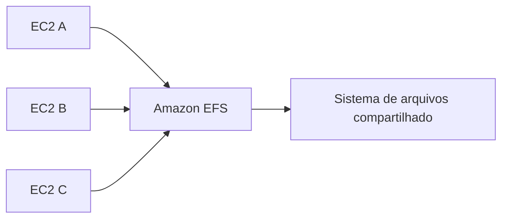

---

title: Amazon EFS - Conceitos
layout: default
description: Conceitos básicos do Amazon Elastic File System, armazenamento de arquivos e comparação com EBS e S3
---

# Amazon EFS - Conceitos

## Visão Geral

`Amazon EFS` significa **Amazon Elastic File System**.

Ele é um serviço de armazenamento de arquivos gerenciado pela AWS.

o EFS fornece um sistema de arquivos que pode ser montado por várias instâncias `Amazon EC2` ao mesmo tempo.

Diferente do `Amazon EBS`, que funciona como um disco anexado a uma instância, o EFS funciona como um file system compartilhado.

**OBS: Não pode ser usado em servidores windows, apenas em linux**
---

## O que é armazenamento de arquivos?

Armazenamento de arquivos organiza os dados em uma estrutura parecida com diretórios e arquivos.

Exemplo:

```text
/app
/app/logs
/app/config
/app/uploads
```

Esse modelo é familiar para aplicações que esperam acessar dados como arquivos em um sistema operacional.

O EFS usa o protocolo `NFS`, então instâncias Linux podem montar o sistema de arquivos e acessar os dados como se fosse um diretório.

O `Amazon EFS` cria um sistema de arquivos compartilhado.

Esse sistema pode ser montado por várias instâncias ao mesmo tempo.

Exemplo:

```text
EC2 A -> monta /mnt/efs
EC2 B -> monta /mnt/efs
EC2 C -> monta /mnt/efs
```

Todas podem acessar os mesmos arquivos.

Isso é útil quando várias máquinas precisam compartilhar dados sem copiar arquivos manualmente entre elas.



---

## EFS é regional

O EFS é um serviço regional.

Isso significa que ele pode ser acessado por instâncias em diferentes zonas de disponibilidade dentro da mesma região, usando mount targets.

Exemplo:

```text
EC2 em us-east-1a -> EFS
EC2 em us-east-1b -> EFS
EC2 em us-east-1c -> EFS
```

Esse é um ponto importante na comparação com EBS.

O `EBS` fica preso a uma zona de disponibilidade.

O `EFS` pode ser acessado por instâncias em múltiplas zonas da mesma região.

---

## Mount targets

Para uma instância EC2 acessar o EFS, normalmente existe um `mount target` dentro da VPC.

O mount target é como um ponto de entrada de rede para o sistema de arquivos.

Em ambientes com várias zonas de disponibilidade, é comum ter um mount target por AZ.

Exemplo:

```text
AZ A -> mount target do EFS
AZ B -> mount target do EFS
AZ C -> mount target do EFS
```

A instância acessa o EFS pela rede, usando NFS.

Por isso, segurança de rede também importa: security groups e regras de rede precisam permitir esse acesso.

---

## EFS vs EBS vs S3

Essa comparação é a parte mais importante.

| Serviço      | Tipo    | Melhor uso                        |
| ------------ | ------- | --------------------------------- |
| `Amazon EBS` | Bloco   | Disco para EC2                    |
| `Amazon EFS` | Arquivo | Sistema de arquivos compartilhado |
| `Amazon S3`  | Objeto  | Data lake, arquivos, logs, backup |

Exemplo prático:

```text
Banco rodando em uma EC2 precisa de disco -> EBS
Várias EC2 precisam acessar a mesma pasta -> EFS
Arquivos Parquet para Athena consultar -> S3
```

EFS não é substituto direto do S3 em data lake.

O S3 continua sendo a base mais comum para data lake e analytics.

EFS aparece quando a aplicação precisa de um sistema de arquivos compartilhado.

---

## Casos de uso comuns

Use EFS quando você precisa de armazenamento compartilhado entre instâncias.

Exemplos:

* aplicações web em múltiplas EC2;
* diretório compartilhado de uploads;
* servidores que precisam acessar os mesmos arquivos;
* workloads Linux que usam NFS;
* ambientes com Auto Scaling;
* containers que precisam de volume compartilhado;
* processamento que depende de file system compartilhado.

---

## Classes de armazenamento do EFS

O EFS também tem classes de armazenamento.

A ideia é parecida com outros serviços: dados acessados com frequência ficam em uma classe mais ativa, e dados pouco acessados podem ir para uma classe mais barata.

As principais ideias são:

| Classe            | Uso                                   |
| ----------------- | ------------------------------------- |
| `EFS Standard`    | Dados acessados com frequência        |
| `EFS Standard-IA` | Dados pouco acessados                 |
| `EFS One Zone`    | Dados em uma única AZ                 |
| `EFS One Zone-IA` | Dados pouco acessados em uma única AZ |


---
## EBS Peformance

### Performance modes

O EFS tem modos de performance.

Os principais conceitos são:

* `General Purpose`;
* `Max I/O`.

`General Purpose` é o modo mais comum e serve para a maioria dos workloads.

`Max I/O` é usado quando muitas instâncias precisam acessar o file system ao mesmo tempo e o throughput total é mais importante, mas pode ter latência um pouco maior.


### Throughput modes

O EFS também tem modos de throughput.

Os principais são:

* `Bursting`;
* `Provisioned`;
* `Elastic`.

`Bursting` varia conforme o tamanho do file system.

`Provisioned` permite definir throughput independente do tamanho armazenado.

`Elastic` ajusta automaticamente conforme o workload.

---
