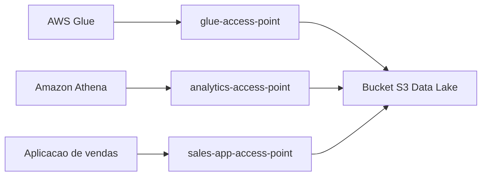

---

title: S3 - Access Points
layout: default
description: S3 Access Points para simplificar controle de acesso em buckets compartilhados e data lakes na AWS
---

# S3 - Access Points

## Visão Geral

`S3 Access Points` são pontos de acesso criados para facilitar o controle de acesso a buckets do `Amazon S3`.

A ideia é evitar colocar todas as regras de acesso diretamente em uma única bucket policy gigante.

Em vez disso, você cria access points separados para usos diferentes.

Exemplo:

```text
Bucket principal: empresa-datalake

Access Point 1: acesso-analytics
Access Point 2: acesso-glue
Access Point 3: acesso-app-vendas
```

Cada access point pode ter sua própria política de acesso.

Isso ajuda principalmente quando um bucket é compartilhado por muitos times, aplicações ou contas.

---

## O problema que Access Points resolvem

Em um data lake, é comum ter vários consumidores acessando o mesmo bucket.

Exemplo:

```text
raw/
trusted/
curated/
logs/
quarantine/
```

O time de engenharia pode precisar acessar `raw/` e `trusted/`.

O time de analytics talvez só possa acessar `curated/`.

Uma aplicação pode gravar apenas em `raw/app-vendas/`.

O `AWS Glue` pode ler uma camada e escrever em outra.

Se tudo isso for controlado em uma única bucket policy, a política pode ficar grande, difícil de manter e fácil de errar.

`S3 Access Points` ajudam a separar esses acessos.

---

## Como funciona

Um access point fica associado a um bucket.

Ele cria uma forma alternativa de acessar os objetos daquele bucket, com uma política própria.

Ou seja, o bucket continua sendo o lugar onde os objetos estão armazenados.

O access point é uma camada de acesso com regras próprias.

---

## Access Point Policy

Cada access point pode ter uma política própria.

Essa política define quem pode acessar, quais ações pode executar e em quais objetos.

Exemplo simples:

```text
Access Point analytics-access:
permite leitura em curated/
```

Exemplo em pipeline:

```text
Access Point glue-access:
permite GetObject em raw/
permite PutObject em trusted/
```

A vantagem é que você organiza permissões por caso de uso, em vez de concentrar tudo em uma única política no bucket.

Para a prova, pense assim:

```text
Access Point = ponto de acesso com política própria para um bucket
```

---

## Access Points e data lake

Access points fazem muito sentido em data lakes.

Um único bucket pode atender vários consumidores:

```text
empresa-datalake/
├── raw/
├── trusted/
├── curated/
├── logs/
└── quarantine/
```

Com access points, você pode criar acessos separados:

```text
analytics-access -> curated/
glue-access -> raw/ e trusted/
logs-access -> logs/
app-access -> raw/app/
```

Isso deixa a administração mais organizada.

Em vez de perguntar “quem pode acessar o bucket inteiro?”, você começa a pensar:

```text
qual ponto de acesso esse consumidor deve usar?
```

---

## Restrição por rede

Access points também podem ajudar a controlar de onde o acesso vem.

Eles podem ser configurados para acesso pela internet ou restritos a uma `VPC`.

Para ambientes de dados mais controlados, isso é importante.

Exemplo:

```text
Access Point do pipeline -> acesso apenas pela VPC
```

Assim, você reduz o risco de acesso vindo diretamente da internet.

Para a prova, guarde:

```text
Access Point pode restringir acesso a uma VPC
```

---

## Access Point ARN

Um access point tem seu próprio ARN.

Em vez de acessar diretamente o bucket, a aplicação ou serviço pode usar o ARN do access point.

Exemplo conceitual:

```text
arn:aws:s3:us-east-1:111122223333:accesspoint/analytics-access
```

E para objetos:

```text
arn:aws:s3:us-east-1:111122223333:accesspoint/analytics-access/object/curated/vendas.parquet
```

Para a prova, não precisa decorar o formato inteiro.

O importante é lembrar que access point tem ARN próprio e política própria.

---

## Access Points vs Bucket Policy

Access points não eliminam bucket policy.

Eles complementam.

A bucket policy ainda pode existir para regras gerais do bucket, como bloquear acesso inseguro.

Exemplo:

```text
Bucket policy:
nega acesso sem HTTPS

Access Point analytics:
permite leitura em curated/

Access Point ingestion:
permite escrita em raw/
```

A diferença principal:

| Recurso             | Ideia                                  |
| ------------------- | -------------------------------------- |
| Bucket policy       | Regras gerais no bucket                |
| Access point policy | Regras específicas por ponto de acesso |

Em buckets simples, uma bucket policy pode ser suficiente.

Em buckets compartilhados por muitos consumidores, access points ajudam bastante.

---

## Exemplo prático

Imagine um data lake no S3 usado por três grupos:

* pipelines do `AWS Glue`;
* analistas com `Athena`;
* aplicação de vendas.

Você pode criar:

```text
glue-access-point
analytics-access-point
sales-app-access-point
```

Com regras como:

```text
glue-access-point:
ler raw/
escrever trusted/

analytics-access-point:
ler curated/

sales-app-access-point:
gravar raw/sales/
```



Esse desenho evita que todo mundo receba acesso amplo ao mesmo bucket.


---

## Quando usar

Use `S3 Access Points` quando:

* muitos consumidores acessam o mesmo bucket;
* a bucket policy está ficando grande e difícil de manter;
* cada aplicação precisa de permissões diferentes;
* você quer controlar acesso por prefixo;
* quer restringir acesso por rede, como `VPC`;
* existe um data lake compartilhado por vários times.


## Resumo rápido

`S3 Access Points` são pontos de acesso com políticas próprias para um bucket S3.

Eles ajudam a organizar permissões em buckets compartilhados, principalmente em data lakes.

O bucket continua sendo o storage.
O access point é uma forma controlada de acessar esse bucket.

Para a prova, lembre:

```text
bucket compartilhado + muitos consumidores + políticas complexas -> S3 Access Points
```

---
