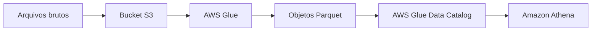

# S3 - Introdução

## Visão Geral

O `Amazon S3` é o serviço de armazenamento de objetos da AWS.

Na prática, ele aparece em quase toda arquitetura de dados: landing zone, data lake, backup, logs, arquivos brutos, dados curados e integração entre serviços.

Se eu tivesse que resumir o S3 do jeito mais direto possível, seria assim:

- você cria um bucket;
- grava objetos dentro dele;
- organiza esses objetos por prefixo;
- usa metadados, tags, permissões e ciclo de vida para controlar o ambiente.

## Por que isso importa em Engenharia de Dados?

Porque o S3 costuma ser a base do lake na AWS.

É nele que os dados normalmente chegam primeiro e também é nele que muita coisa continua armazenada para consulta com `Athena`, transformação com `Glue`, processamento com `EMR` ou carga para `Redshift`.

Para a `DEA-C01`, S3 não é detalhe. É peça central.

## Bucket

O bucket é o contêiner lógico do S3.

É como se fosse o espaço principal onde você vai guardar os objetos. Ele não é o arquivo em si. Ele é o lugar onde os arquivos ficam.

Exemplo:

```text
Bucket: dados-vendas
```

Dentro desse bucket, você pode ter vários objetos organizados por caminho lógico.

## Objeto

O objeto é a unidade armazenada no S3.

Pode ser:

- um `CSV`;
- um `JSON`;
- um `Parquet`;
- uma imagem;
- um log;
- um backup;
- qualquer arquivo binário.

Exemplo:

```text
Bucket: dados-vendas
Objeto: raw/2026/06/11/pedidos.csv
```

No S3, esse "caminho" não é pasta real como em sistema de arquivos tradicional. É chave de objeto. Mas, no dia a dia, pensar nisso como organização por pastas ajuda bastante.

## Tags

Tags são pares de chave e valor usados para classificar e organizar recursos.

No contexto do S3, elas podem aparecer tanto no bucket quanto em objetos, dependendo do caso.

Exemplos de tags:

```text
ambiente=producao
time=dados
sensibilidade=restrito
```

Na prática, tags ajudam em:

- organização;
- governança;
- controle de custo;
- automação;
- identificação de owner;
- políticas baseadas em classificação.

Em ambiente de dados, isso é útil porque nem todo arquivo no S3 tem o mesmo uso, o mesmo dono ou o mesmo nível de sensibilidade.

## Como aparece na AWS

O S3 conversa com quase tudo no ecossistema de dados da AWS:

- `AWS Glue` lê e transforma arquivos no S3;
- `AWS Glue Crawlers` inferem schema;
- `Amazon Athena` consulta dados direto no bucket;
- `Amazon Redshift` pode carregar ou consultar dados no S3;
- `Amazon EMR` processa grandes volumes armazenados ali;
- `AWS Lake Formation` ajuda na governança do lake;
- `AWS Lambda` pode reagir à chegada de novos objetos.

## Exemplo prático

Um pipeline simples pode funcionar assim:

- arquivos brutos chegam em um bucket de ingestão;
- um job do `AWS Glue` transforma os dados;
- o resultado vai para outro prefixo em `Parquet`;
- o catálogo é atualizado;
- `Athena` consulta a camada curada.



## Regras básicas de nomeação de bucket

Aqui vale guardar só o que mais cai e o que mais evita erro:

- o nome deve ter entre `3` e `63` caracteres;
- deve começar e terminar com letra minúscula ou número;
- só pode usar letras minúsculas, números, ponto (`.`) e hífen (`-`);
- não pode começar com `xn--`;
- não pode terminar com `-s3alias`.

Exemplo válido:

```text
dados-vendas-2026
```

Exemplo inválido:

```text
Dados_Vendas
```

Esse falha porque tem letra maiúscula e underscore.

## Pegadinhas para a prova

- S3 é armazenamento de objetos, não bloco nem arquivo tradicional.
- Bucket é o contêiner; objeto é o item armazenado.
- O "caminho" do objeto é chave, não pasta real.
- Tags ajudam em organização e governança, não só em custo.
- Em questões de data lake na AWS, S3 quase sempre está no centro da arquitetura.

## Resumo rápido

- `Amazon S3` é o serviço de armazenamento de objetos da AWS.
- Bucket é o contêiner lógico.
- Objeto é o arquivo armazenado.
- Tags ajudam a classificar e governar buckets e objetos.
- Para bucket, lembre principalmente das regras básicas de nome.

## Checklist para prova

- [ ] Saber a diferença entre bucket e objeto
- [ ] Lembrar que S3 é armazenamento de objetos
- [ ] Entender o papel de tags em organização e governança
- [ ] Associar S3 a data lake, ingestão e analytics
- [ ] Guardar as regras básicas de nomeação de bucket
