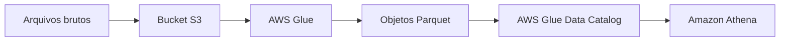

---

title: S3 - Introdução
layout: default
description: Introdução ao Amazon S3 com foco em buckets, objetos, prefixos, metadados, tags e regras básicas de nomeação
---

# S3 - Introdução

## Visão Geral

O `Amazon S3` é o serviço de armazenamento de objetos da AWS.

Ele aparece em quase toda arquitetura de dados na nuvem: ingestão de arquivos, data lake, backup, logs, camada bruta, camada curada e integração entre serviços.

A ideia básica é simples:

* você cria um bucket;
* grava objetos dentro dele;
* organiza esses objetos por prefixos;
* usa metadados, tags, permissões e políticas para controlar melhor o ambiente.

Para Engenharia de Dados, o S3 é uma peça central. Antes de um dado ser transformado pelo `AWS Glue`, consultado pelo `Athena`, processado no `EMR` ou carregado no `Redshift`, muitas vezes ele já passou por um bucket.

---

## Onde o S3 entra na prática

O S3 costuma ser a base do data lake na AWS.

Arquivos chegam no S3, são processados por algum serviço e podem continuar ali em uma camada mais tratada.

Um fluxo comum seria:

```text
dados brutos -> S3 -> Glue -> Parquet no S3 -> Athena
```

Nesse cenário, o S3 não é só um lugar para guardar arquivo. Ele vira a base de armazenamento para ingestão, transformação e consulta analítica.

Na `DEA-C01`, sempre que aparecer data lake, arquivos, ingestão, camada `raw`, camada `curated` ou consulta com `Athena`, vale pensar em S3.

---

## Bucket

O bucket é o contêiner onde os objetos ficam armazenados.

Ele não é o arquivo. Ele é o espaço lógico onde você coloca os objetos.

Exemplo:

```text
Bucket: dados-vendas
```

Dentro desse bucket, você pode ter vários objetos organizados por chave:

```text
raw/2026/06/11/pedidos.csv
curated/vendas/ano=2026/mes=06/vendas.parquet
logs/app/2026/06/11/eventos.json
```

Uma coisa importante: o nome do bucket precisa ser único globalmente na AWS. Se alguém já criou um bucket com aquele nome, você não consegue criar outro igual.

Por isso, em ambientes reais, é comum usar nomes mais específicos, incluindo empresa, área, ambiente ou região.

Exemplo:

```text
empresa-dados-vendas-prod
```

---

## Objeto

O objeto é o item armazenado dentro do S3.


Ele pode ser um arquivo `CSV`, `JSON`, `Parquet`, uma imagem, um log, um backup ou qualquer conteúdo binário.

Exemplo:

```text
Bucket: dados-vendas
Objeto: raw/2026/06/11/pedidos.csv
```

No S3, um objeto é composto principalmente por:

* o conteúdo do arquivo;
* a chave do objeto;
* metadados;
* tags, se existirem;
* versão, se o versionamento estiver habilitado.

A chave do objeto é o nome completo dele dentro do bucket.

Exemplo:

```text
raw/2026/06/11/pedidos.csv
```

Esse caminho parece uma pasta, mas tecnicamente é uma chave. O S3 não funciona como um sistema de arquivos tradicional com diretórios reais.

Mesmo assim, organizar os objetos por caminhos lógicos ajuda bastante no dia a dia.

---

## Prefixos

Prefixo é a parte inicial da chave do objeto.

Exemplo:

```text
raw/2026/06/11/pedidos.csv
```

Aqui, um prefixo poderia ser:

```text
raw/2026/06/11/
```

Em Engenharia de Dados, prefixos são usados para organizar melhor o data lake.

Exemplo por camada:

```text
raw/
trusted/
curated/
```

Exemplo por data:

```text
eventos/ano=2026/mes=06/dia=11/
```

Essa organização ajuda na leitura, no particionamento lógico, na governança e no controle de custo.

O cuidado é lembrar que prefixo não é uma pasta real. Ele funciona como uma forma prática de organizar as chaves dos objetos.

---

## Metadados

Metadados são informações associadas a um objeto.

Eles não são o conteúdo do arquivo. Eles descrevem características daquele objeto.

Exemplo: se você grava um arquivo `pedidos.csv`, o conteúdo do arquivo são os dados dos pedidos. Já os metadados podem informar o tipo do conteúdo, o tamanho, a data de modificação e outras informações usadas pelo S3 ou por aplicações.

Alguns metadados são definidos automaticamente pelo próprio S3.

Exemplos:

```text
Content-Length
Last-Modified
ETag
Content-Type
```

Exemplo prático:

```text
Objeto: raw/2026/06/11/pedidos.csv
Content-Type: text/csv
Content-Length: 25 MB
Last-Modified: 2026-06-11
```

Também podem existir metadados customizados, definidos por quem grava o objeto.

Exemplo:

```text
origem=sistema-pedidos
camada=raw
responsavel=time-dados
```

Na prática, metadados ajudam outros sistemas a entenderem melhor o objeto e podem apoiar integrações, processamento e rastreabilidade.

Um cuidado importante: metadados não são a mesma coisa que tags.

Metadados descrevem características do objeto.
Tags classificam o recurso para organização, custo, automação ou governança.

Resumo simples:

| Recurso   | Ideia                                         |
| --------- | --------------------------------------------- |
| Chave     | Nome completo do objeto dentro do bucket      |
| Prefixo   | Parte inicial da chave usada para organização |
| Metadados | Informações que descrevem o objeto            |
| Tags      | Classificação para gestão, custo e governança |

---

## Tags

Tags são pares de chave e valor usados para classificar recursos.

Exemplos:

```text
ambiente=producao
time=dados
projeto=lakehouse
sensibilidade=restrito
```

No S3, tags podem ajudar em:

* organização;
* controle de custo;
* identificação de dono;
* automações;
* governança;
* classificação de dados;
* políticas de acesso em alguns cenários.

Em um ambiente de dados, isso é útil porque nem todo bucket ou objeto tem o mesmo propósito.

Um bucket pode guardar dado público.
Outro pode guardar dado sensível.
Outro pode ser usado só para logs ou quarentena.

As tags ajudam a deixar essa classificação mais clara e mais controlável.

---

## Como o S3 aparece em pipelines de dados

O S3 conversa com muitos serviços da AWS.

Exemplos:

* `AWS Glue` lê e transforma arquivos no S3;
* `Glue Crawlers` inferem schema dos dados;
* `AWS Glue Data Catalog` guarda metadados das tabelas;
* `Amazon Athena` consulta arquivos diretamente no S3;
* `Amazon EMR` processa grandes volumes armazenados no S3;
* `Amazon Redshift` pode carregar ou consultar dados no S3;
* `AWS Lake Formation` ajuda na governança do data lake;
* `AWS Lambda` pode reagir à chegada de novos objetos.

Um pipeline simples pode funcionar assim:

1. Arquivos brutos chegam no S3;
2. Um job do `AWS Glue` lê esses arquivos;
3. O job transforma os dados;
4. O resultado é salvo em `Parquet`;
5. A tabela é catalogada;
6. O `Athena` consulta a camada tratada.



---

## Regras básicas de nomeação de bucket

Para a prova, vale guardar as regras principais.

O nome do bucket:

* deve ter entre `3` e `63` caracteres;
* deve começar e terminar com letra minúscula ou número;
* pode usar letras minúsculas, números, ponto (`.`) e hífen (`-`);
* não pode usar letra maiúscula;
* não pode usar underscore (`_`);
* não pode começar com `xn--`;
* não pode terminar com `-s3alias`.

Exemplo válido:

```text
dados-vendas-2026
```

Exemplo inválido:

```text
Dados_Vendas
```

Esse nome é inválido porque usa letra maiúscula e underscore.

---

## Pegadinhas para a prova

* S3 é armazenamento de objetos, não armazenamento em bloco.
* Bucket é o contêiner.
* Objeto é o item armazenado.
* O “caminho” do objeto é uma chave, não uma pasta real.
* Prefixos ajudam a organizar os objetos.
* Metadados descrevem características do objeto.
* Tags ajudam em organização, custo, automação e governança.
* Em data lake na AWS, S3 quase sempre aparece como base.
* `Athena` consulta dados no S3, mas não armazena os dados.
* `Glue` transforma dados no S3, mas o S3 continua sendo o storage.

---

## Resumo rápido

O `Amazon S3` é o serviço de armazenamento de objetos da AWS.

Em Engenharia de Dados, ele é usado como base para data lakes, ingestão, armazenamento bruto, camadas tratadas, logs e integração com outros serviços.

Bucket é o contêiner.
Objeto é o item armazenado.
Chave é o nome completo do objeto.
Prefixo organiza objetos pela chave.
Metadados descrevem o objeto.
Tags ajudam a classificar e governar recursos.

Para a prova, associe S3 a data lake, arquivos, objetos, buckets, prefixos, `Glue`, `Athena` e armazenamento escalável.

---

