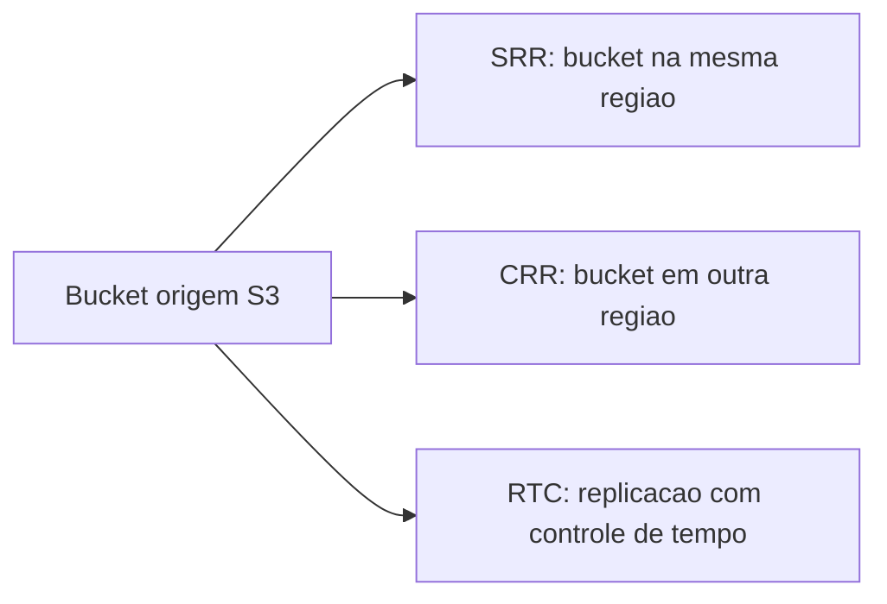

---

title: S3 - Replicação
layout: default
description: Replicação no Amazon S3 com foco em CRR, SRR e RTC para a AWS DEA-C01
---

# S3 - Replicação

## Visão Geral

Replicação no `Amazon S3` é o recurso usado para copiar objetos automaticamente de um bucket para outro.

Essa cópia pode acontecer:
 2
* entre buckets na mesma região;
* entre buckets em regiões diferentes;
* entre contas AWS diferentes;
* para todos os objetos ou apenas para objetos que passam em algum filtro.

Para a `DEA-C01`, o ponto principal é entender a diferença entre:

* `SRR`: Same-Region Replication;
* `CRR`: Cross-Region Replication;
* `RTC`: Replication Time Control.

Também é importante lembrar que a replicação do S3 depende de versionamento habilitado nos buckets envolvidos. A AWS documenta que a replicação exige versionamento no bucket de origem e no bucket de destino.

---

## Como funciona

Na replicação, você define uma regra no bucket de origem.

Essa regra diz algo como:

```text id="y2s4zy"
replicar objetos deste bucket/prefixo para aquele bucket de destino
```

Exemplo:

```text id="bf3hpz"
Bucket origem: empresa-datalake-raw
Bucket destino: empresa-datalake-backup
Prefixo: vendas/
```

A partir daí, novos objetos que combinam com a regra podem ser copiados automaticamente para o destino.

Um ponto importante: replicação normal é para novos objetos depois da regra configurada. Para objetos que já existiam antes, existe o recurso de `S3 Batch Replication`, que replica objetos existentes sob demanda.

---

## SRR - Same-Region Replication

`SRR` significa **Same-Region Replication**.

É a replicação entre buckets na mesma região AWS.

Exemplo:

```text id="qm4mis"
Origem: s3://empresa-datalake-raw      us-east-1
Destino: s3://empresa-datalake-backup   us-east-1
```

Use `SRR` quando você quer manter uma cópia dos dados na mesma região.

Cenários comuns:

* separar dados por conta ou time;
* manter cópia para processamento;
* replicar logs para um bucket central;
* criar cópia com permissões diferentes;
* manter dados no mesmo limite regional por compliance.

Na prova, pense assim:

```text id="5iqst3"
SRR = replica na mesma região
```

---

## CRR - Cross-Region Replication

`CRR` significa **Cross-Region Replication**.

É a replicação entre buckets em regiões AWS diferentes.

Exemplo:

```text id="kjhlbw"
Origem: s3://empresa-datalake-prod      us-east-1
Destino: s3://empresa-datalake-dr       us-west-2
```

Use `CRR` quando você precisa que os dados existam em outra região.

Cenários comuns:

* recuperação de desastre;
* compliance geográfico;
* redução de latência para acesso em outra região;
* cópia regional de dados críticos;
* estratégia multi-region.

Na prova, pense assim:

```text id="je6w7n"
CRR = replica entre regiões diferentes
```

A própria documentação da AWS separa `CRR` como replicação entre buckets em regiões diferentes e `SRR` como replicação entre buckets na mesma região.

---

## RTC - Replication Time Control

`RTC` significa **Replication Time Control**.

Ele não é um terceiro tipo de destino como `SRR` ou `CRR`.

O `RTC` é um recurso usado quando você precisa de previsibilidade no tempo de replicação.

Na prática, ele ajuda a garantir que a replicação aconteça dentro de uma janela esperada.

A AWS descreve o `S3 RTC` como um recurso para atender requisitos de negócio ou compliance relacionados ao tempo de replicação, replicando a maior parte dos objetos em segundos e 99,99% dos novos objetos em até 15 minutos com SLA.

Use `RTC` quando o cenário exige algo como:

```text id="bmmh2c"
os objetos precisam ser replicados em até 15 minutos
```

Cenários comuns:

* compliance;
* recuperação de desastre com requisito de tempo;
* dados críticos;
* necessidade de monitorar atraso de replicação;
* arquitetura multi-region com SLA de replicação.

Para a prova, guarde:

```text id="tc5tzd"
RTC = controle de tempo da replicação
```

---

## Comparação rápida

| Recurso | O que faz                        | Quando usar                                           |
| ------- | -------------------------------- | ----------------------------------------------------- |
| `SRR`   | Replica na mesma região          | Cópia local, separação por conta, logs centralizados  |
| `CRR`   | Replica entre regiões diferentes | Disaster recovery, compliance regional, multi-region  |
| `RTC`   | Controla tempo de replicação     | Quando existe requisito de replicar em até 15 minutos |

---

## Exemplo prático

Imagine um data lake de produção no S3.

A empresa quer:

* manter uma cópia dos dados curados em outra conta da mesma região;
* manter uma cópia crítica em outra região para disaster recovery;
* garantir que certos dados críticos sejam replicados em uma janela previsível.

Isso poderia virar:

```text id="umwll7"
SRR -> cópia na mesma região para outra conta
CRR -> cópia em outra região para DR
RTC -> controle de tempo para dados críticos
```



---

## Requisitos importantes

Para a prova, guarde estes pontos:

* o versionamento precisa estar habilitado nos buckets;
* a replicação é configurada por regra;
* a regra pode usar filtros, como prefixo ou tags;
* o S3 precisa ter permissão IAM para replicar os objetos;
* o destino pode estar na mesma conta ou em outra conta;
* objetos já existentes podem exigir `S3 Batch Replication`;
* objetos criptografados com `KMS` podem exigir permissões extras.

A parte de permissão é importante porque o S3 precisa conseguir ler o objeto na origem e gravar no destino.

---

## Replicação e delete marker

Com versionamento habilitado, quando você deleta um objeto, o S3 pode criar um `delete marker`.

Em replicação, esse detalhe pode virar ponto de atenção.

De forma simples:

```text id="p81mug"
delete marker pode ser replicado dependendo da configuração
exclusão de uma versão específica não é replicada para apagar a versão no destino
```

Esse comportamento ajuda a evitar que uma exclusão maliciosa ou acidental de uma versão específica destrua também a cópia replicada. A documentação da AWS destaca que, ao excluir uma versão específica no bucket de origem, essa exclusão não é replicada para o destino.

Para a prova, não precisa decorar todos os detalhes finos. O importante é lembrar que versionamento, delete marker e replicação estão conectados.


---

## Atenção para a prova

* `SRR` replica na mesma região.
* `CRR` replica entre regiões diferentes.
* `RTC` controla o tempo de replicação.
* `RTC` não é um tipo separado de região; ele adiciona previsibilidade/SLA.
* Replicação exige versionamento habilitado.
* A replicação é baseada em regras.
* Regras podem usar filtros por prefixo ou tags.
* `S3 Batch Replication` é usado para objetos existentes.
* Objetos criptografados com `KMS` podem precisar de permissões extras.
* Replicação não substitui controle de acesso.
* Replicação pode aumentar custo de armazenamento e transferência.

---

## Quando usar

Use `SRR` quando você quer replicar dados dentro da mesma região.

Use `CRR` quando precisa de cópia em outra região.

Use `RTC` quando existe requisito de tempo para a replicação.

Exemplo mental:

```text id="t58qkh"
mesma região -> SRR
outra região -> CRR
tempo previsível/SLA -> RTC
```

---


## Resumo rápido

Replicação no S3 copia objetos automaticamente de um bucket para outro.

`SRR` replica dentro da mesma região.
`CRR` replica entre regiões diferentes.
`RTC` adiciona controle de tempo para replicação, útil quando existe requisito de compliance ou SLA.

Para a `DEA-C01`, associe replicação a versionamento, regras, prefixos/tags, cópia entre buckets, disaster recovery, cross-account e controle de tempo.

---
