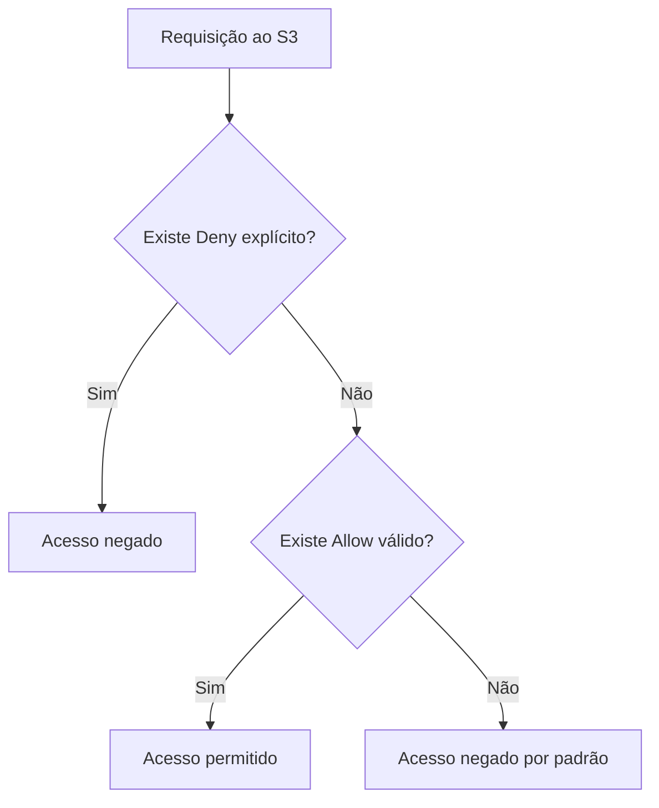

# S3 - Segurança

## Visão Geral

Segurança no `Amazon S3` gira em torno de uma pergunta simples:

```text
quem pode acessar qual bucket ou objeto, em quais condições?
```

Na prática, esse controle pode ser feito de duas formas principais:

* segurança baseada no usuário, usando políticas do `IAM`;
* segurança baseada no recurso, usando `bucket policies` e, em cenários mais antigos, `ACLs`.

Para a `DEA-C01`, o ponto mais importante é entender quando usar cada uma e como a AWS avalia permissões.

Em ambientes de dados, isso aparece o tempo todo: pipelines do `AWS Glue`, consultas do `Athena`, cargas do `Redshift`, jobs do `EMR`, lambdas de ingestão e contas diferentes acessando o mesmo data lake.

---

## Por que isso importa em Engenharia de Dados?

Um bucket S3 costuma guardar dados brutos, dados tratados, logs, arquivos sensíveis, resultados de consulta e artefatos de processamento.

Se a permissão estiver aberta demais, o risco é vazamento de dados.

Se estiver restrita demais, o pipeline quebra.

Exemplo comum:

```text
Glue precisa ler raw/
Glue precisa escrever curated/
Athena precisa ler curated/
Usuários analíticos não devem ler raw/ com dados sensíveis
```

Esse tipo de separação é segurança aplicada a arquitetura de dados. Não é só "dar acesso ao bucket".

---

## Segurança baseada no usuário

Segurança baseada no usuário usa políticas associadas a uma identidade do `IAM`.

Essa identidade pode ser:

* usuário IAM;
* grupo IAM;
* role IAM;
* role assumida por um serviço da AWS.

Exemplo: uma role usada por um job do `AWS Glue` pode receber permissão para ler objetos de um prefixo e gravar em outro.

```json
{
  "Version": "2012-10-17",
  "Statement": [
    {
      "Effect": "Allow",
      "Action": [
        "s3:GetObject"
      ],
      "Resource": "arn:aws:s3:::empresa-datalake-raw/*"
    }
  ]
}
```

Essa política está presa à identidade. Ou seja: a role tem a permissão.

Isso é útil quando você controla quem ou qual serviço precisa acessar o S3.

Exemplos:

* role do `AWS Glue` para processar arquivos;
* role do `Amazon EMR` para ler dados do data lake;
* usuário de engenharia com acesso limitado a buckets de desenvolvimento;
* role de uma aplicação que grava eventos em um prefixo específico.

---

## Segurança baseada no recurso

Segurança baseada no recurso usa uma política colocada diretamente no recurso.

No S3, o exemplo principal é a `bucket policy`.

Em vez de dizer "esta role pode acessar tal bucket", você diz no próprio bucket:

```text
este bucket permite acesso para estas identidades, ações e condições
```

Isso é muito usado quando:

* várias identidades precisam acessar o mesmo bucket;
* outra conta AWS precisa acessar o bucket;
* você quer exigir uma condição de segurança no próprio bucket;
* quer bloquear acesso inseguro independentemente da política do usuário.

Exemplo de condição comum: negar acesso sem HTTPS.

```json
{
  "Version": "2012-10-17",
  "Statement": [
    {
      "Sid": "DenyInsecureTransport",
      "Effect": "Deny",
      "Principal": "*",
      "Action": "s3:*",
      "Resource": [
        "arn:aws:s3:::empresa-datalake",
        "arn:aws:s3:::empresa-datalake/*"
      ],
      "Condition": {
        "Bool": {
          "aws:SecureTransport": "false"
        }
      }
    }
  ]
}
```

Esse tipo de regra é forte porque o `Deny` explícito vence permissões concedidas em outros lugares.

---

## Bucket policies

`Bucket policy` é uma política JSON anexada ao bucket S3.

Ela define permissões usando principalmente:

| Campo | Para que serve |
| --- | --- |
| `Effect` | Define se a regra permite ou nega |
| `Principal` | Define quem recebe a regra |
| `Action` | Define quais ações do S3 entram na regra |
| `Resource` | Define quais buckets ou objetos são afetados |
| `Condition` | Define condições extras para a regra valer |

Exemplo simples: permitir que uma role leia objetos de um bucket.

```json
{
  "Version": "2012-10-17",
  "Statement": [
    {
      "Sid": "AllowAnalyticsRoleRead",
      "Effect": "Allow",
      "Principal": {
        "AWS": "arn:aws:iam::111122223333:role/analytics-role"
      },
      "Action": "s3:GetObject",
      "Resource": "arn:aws:s3:::empresa-datalake-curated/*"
    }
  ]
}
```

Repare em um detalhe importante:

```text
arn:aws:s3:::empresa-datalake-curated
arn:aws:s3:::empresa-datalake-curated/*
```

O primeiro ARN representa o bucket.
O segundo representa os objetos dentro do bucket.

Algumas ações usam o ARN do bucket, como `s3:ListBucket`.
Outras usam o ARN dos objetos, como `s3:GetObject`.

Exemplo com listagem do bucket e leitura dos objetos:

```json
{
  "Version": "2012-10-17",
  "Statement": [
    {
      "Sid": "AllowListBucket",
      "Effect": "Allow",
      "Principal": {
        "AWS": "arn:aws:iam::111122223333:role/analytics-role"
      },
      "Action": "s3:ListBucket",
      "Resource": "arn:aws:s3:::empresa-datalake-curated",
      "Condition": {
        "StringLike": {
          "s3:prefix": [
            "vendas/*"
          ]
        }
      }
    },
    {
      "Sid": "AllowReadObjects",
      "Effect": "Allow",
      "Principal": {
        "AWS": "arn:aws:iam::111122223333:role/analytics-role"
      },
      "Action": "s3:GetObject",
      "Resource": "arn:aws:s3:::empresa-datalake-curated/vendas/*"
    }
  ]
}
```

Esse padrão aparece bastante em data lake: liberar acesso por prefixo.

---

## IAM policy vs bucket policy

As duas podem conceder acesso ao S3, mas ficam em lugares diferentes.

| Tipo | Onde fica | Ideia |
| --- | --- | --- |
| IAM policy | Na identidade | Esta identidade pode fazer algo |
| Bucket policy | No bucket | Este bucket aceita ou nega acesso |

Exemplo mental:

```text
IAM policy:
Role do Glue pode ler s3://empresa-datalake-raw/

Bucket policy:
Bucket empresa-datalake-raw permite leitura pela role do Glue
```

Em acesso dentro da mesma conta, muitas vezes a política IAM já resolve.

Em acesso entre contas, a bucket policy fica muito importante, porque o bucket precisa confiar na identidade da outra conta.

---

## ACLs

`ACL` significa `Access Control List`.

ACL é um mecanismo mais antigo de controle de acesso no S3. Ela pode ser aplicada em bucket ou objeto para conceder permissões básicas.

Hoje, a recomendação prática é evitar ACL sempre que possível e preferir:

* IAM policies;
* bucket policies;
* S3 Block Public Access;
* S3 Object Ownership com ACLs desabilitadas.

Para a prova, guarde a ideia:

```text
ACL existe, mas bucket policy e IAM policy são os mecanismos principais.
```

ACL ainda pode aparecer em perguntas sobre:

* objetos gravados por outra conta;
* controle legado;
* permissões antigas em nível de objeto;
* cenários em que o dono do bucket e o dono do objeto podem ser diferentes.

Mas, em arquitetura moderna, se a questão perguntar a melhor forma de controlar acesso a um bucket, normalmente a resposta não deve ser ACL.

---

## S3 Block Public Access

`S3 Block Public Access` é uma camada de proteção para impedir exposição pública acidental.

Ele pode ser configurado em nível de conta ou bucket.

Na prática, ele ajuda a bloquear:

* bucket policies públicas;
* ACLs públicas;
* acesso público concedido de forma acidental.

Isso é especialmente importante em data lake, porque um erro de política pode expor uma grande quantidade de dados.

Para a prova, associe:

```text
evitar bucket público acidental -> S3 Block Public Access
```

---

## Como a AWS avalia permissões

A avaliação de permissões segue algumas ideias importantes.

Primeiro: por padrão, tudo é negado.

```text
sem permissão explícita -> acesso negado
```

Segundo: uma permissão `Allow` precisa existir em algum lugar válido.

Terceiro: um `Deny` explícito vence qualquer `Allow`.

```text
Explicit Deny > Allow > Default Deny
```

Isso explica por que bucket policies com `Deny` são muito usadas para regras obrigatórias, como negar acesso sem HTTPS ou negar upload sem criptografia.



---

## Exemplo prático

Imagine um data lake com três áreas:

```text
raw/
trusted/
curated/
```

Você quer o seguinte:

* jobs de ingestão gravam em `raw/`;
* jobs do `Glue` leem `raw/` e escrevem em `trusted/`;
* analistas consultam apenas `curated/` pelo `Athena`;
* ninguém deve acessar o bucket sem HTTPS.

Uma arquitetura de permissões poderia ser:

```text
IAM role da ingestão -> PutObject em raw/
IAM role do Glue -> GetObject em raw/ e PutObject em trusted/
IAM role dos analistas/Athena -> GetObject em curated/
Bucket policy -> Deny se aws:SecureTransport = false
Block Public Access -> habilitado
ACLs -> desabilitadas sempre que possível
```

O mais importante é não tratar o bucket como um bloco único. Em data lake, muitas vezes o controle precisa ser por prefixo.

---

## Quando usar cada abordagem

Use `IAM policy` quando o foco é controlar o que uma identidade pode fazer.

Exemplos:

* role do Glue;
* role do EMR;
* role de aplicação;
* usuário ou grupo de desenvolvimento.

Use `bucket policy` quando o foco é controlar o acesso ao bucket.

Exemplos:

* permitir acesso entre contas;
* exigir HTTPS;
* restringir por prefixo;
* negar ações inseguras;
* centralizar regras obrigatórias no bucket.

Evite `ACL` em novos desenhos, a menos que a questão deixe claro que é um cenário legado ou específico de propriedade de objeto.

---

## Atenção para a prova

* S3 é privado por padrão.
* `Deny` explícito sempre vence `Allow`.
* `s3:ListBucket` usa ARN do bucket, não ARN dos objetos.
* `s3:GetObject` usa ARN dos objetos, normalmente com `/*`.
* IAM policy é baseada na identidade.
* Bucket policy é baseada no recurso.
* Bucket policy é comum para acesso cross-account.
* ACL é mecanismo antigo e geralmente não é a melhor resposta em arquitetura moderna.
* `Block Public Access` ajuda a evitar exposição pública acidental.
* Controlar acesso por prefixo é comum em data lakes.
* Permissão para listar bucket não significa permissão para ler objetos.
* Permissão para ler objetos não significa permissão para listar o bucket.

---

## Resumo rápido

Segurança no S3 combina controle por identidade e por recurso.

`IAM policies` dizem o que usuários, grupos e roles podem fazer.

`Bucket policies` dizem quem pode acessar o bucket ou seus objetos, e sob quais condições.

`ACLs` existem, mas são mecanismo legado e devem ser evitadas na maioria dos desenhos modernos.

Para a `DEA-C01`, foque em `IAM`, `bucket policy`, `Block Public Access`, diferença entre bucket e objeto no ARN, acesso por prefixo, cross-account e na regra de ouro:

```text
Deny explícito vence tudo.
```

---

## Checklist para prova

Antes de responder uma questão sobre S3 e segurança, pergunte:

* A permissão deve ficar na identidade ou no bucket?
* O acesso é dentro da mesma conta ou entre contas?
* A ação é no bucket ou no objeto?
* Existe `Deny` explícito?
* O bucket precisa bloquear acesso público?
* A questão está tentando empurrar ACL como resposta, mesmo havendo opção melhor?
* O acesso precisa ser limitado por prefixo?
* O serviço que acessa o S3 está usando uma role correta?
