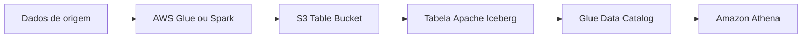

# S3 - Tables

## Visão Geral

`Amazon S3 Tables` é um recurso do S3 voltado para armazenar dados tabulares em formato de tabela, usando `Apache Iceberg`.

A ideia é deixar o S3 mais preparado para cenários de lakehouse.

Em vez de tratar o S3 apenas como um lugar cheio de arquivos soltos, o `S3 Tables` organiza os dados como tabelas gerenciadas, com metadados, snapshots e manutenção automática.

Para a `DEA-C01`, pense assim:

```text
S3 tradicional -> objetos e arquivos
S3 Tables -> tabelas Iceberg gerenciadas no S3
```

A AWS descreve o S3 Tables como tabelas Apache Iceberg totalmente gerenciadas para data lakes e lakehouses, com manutenção automática para reduzir trabalho operacional.

---

## O problema que S3 Tables tenta resolver

Em um data lake tradicional no S3, é comum armazenar arquivos em `CSV`, `JSON` ou `Parquet`.

Isso funciona, mas conforme o lake cresce, aparecem alguns problemas:

* muitos arquivos pequenos;
* dificuldade para controlar metadados;
* necessidade de compactação;
* evolução de schema;
* manutenção de snapshots;
* operações de tabela mais complexas;
* múltiplos motores acessando os mesmos dados.

Com formatos como `Apache Iceberg`, o lake passa a ter uma camada de tabela em cima dos arquivos.

O `S3 Tables` entra para tornar essa camada mais gerenciada dentro do próprio S3.

---

## Apache Iceberg

Todas as tabelas em um table bucket do S3 Tables são armazenadas no formato `Apache Iceberg`.

`Iceberg` é um formato de tabela aberto usado em data lakes e lakehouses.

Ele ajuda em recursos como:

* snapshots;
* evolução de schema;
* evolução de particionamento;
* operações de tabela;
* leitura por diferentes engines;
* melhor controle de metadados.

Exemplo simples:

```text
Sem Iceberg:
S3 guarda arquivos Parquet organizados por prefixo

Com Iceberg:
S3 guarda arquivos Parquet + metadados de tabela + snapshots
```

Para a prova, guarde:

```text
S3 Tables = tabelas Apache Iceberg gerenciadas no S3
```

---

## Table bucket

`Table bucket` é um tipo de bucket do S3 criado para armazenar tabelas do S3 Tables.

Ele não é igual a um bucket S3 comum usado para objetos genéricos.

A ideia do table bucket é armazenar tabelas e seus metadados de forma organizada.

Exemplo mental:

```text
Table bucket: empresa-tabelas-analytics
Tabela: vendas
Tabela: clientes
Tabela: eventos
```

Segundo a documentação da AWS, as tabelas ficam dentro de table buckets e são armazenadas como subrecursos do bucket.

Para a prova:

```text
table bucket = bucket especializado para S3 Tables
```

---

## Namespace

Namespace é uma forma de organizar tabelas dentro de um table bucket.

Ele funciona como um agrupamento lógico.

Exemplo:

```text
Namespace: vendas
Tabela: pedidos
Tabela: clientes

Namespace: marketing
Tabela: campanhas
Tabela: eventos
```

Um detalhe importante: namespace ajuda a organizar, mas não é tratado como recurso separado como uma tabela ou table bucket. A AWS descreve namespaces como construções lógicas para organizar tabelas em um table bucket.

Para a prova:

```text
namespace = agrupamento lógico de tabelas
```

---

## Tabela

Uma tabela no S3 Tables representa um dataset estruturado.

Ela tem dados e metadados associados.

Exemplo:

```text
Table bucket: empresa-analytics
Namespace: vendas
Tabela: pedidos
```

Essa tabela pode ser consultada por engines compatíveis com `Iceberg`, como `Athena`, `Spark`, `Trino` e outras ferramentas.

A AWS documenta que tabelas em table buckets podem ser consultadas com SQL por engines que suportam Iceberg.

---

## Manutenção automática

Um ponto forte do `S3 Tables` é reduzir parte do trabalho operacional de manter tabelas Iceberg.

Em tabelas Iceberg comuns no S3, você muitas vezes precisa se preocupar com tarefas como:

* compactação de arquivos;
* limpeza de arquivos antigos;
* gerenciamento de snapshots;
* manutenção de metadados;
* otimização de performance.

No `S3 Tables`, a AWS gerencia parte dessa manutenção automaticamente, incluindo compactação e gerenciamento de snapshots.

Isso importa porque um lakehouse não é só criar uma tabela Iceberg. Também é preciso manter essa tabela saudável ao longo do tempo.

---

## Integração com Glue e Athena

Para consultar S3 Tables com serviços analíticos da AWS, a integração com `AWS Glue Data Catalog` é importante.

A AWS permite integrar o catálogo do S3 Tables com o `Glue Data Catalog`. Quando essa integração é habilitada, é criado um catálogo federado chamado `s3tablescatalog`, que ajuda a expor os table buckets para consulta.

Com isso, serviços como `Amazon Athena` podem consultar essas tabelas.

Exemplo de fluxo:

```text
S3 Table Bucket -> Glue Data Catalog -> Athena
```

Para a prova, guarde:

```text
S3 Tables + Glue Data Catalog + Athena = consulta SQL em tabelas Iceberg no S3
```

---

## Exemplo prático

Imagine um time de dados criando uma camada analítica no S3.

Antes, eles poderiam manter arquivos Parquet assim:

```text
s3://empresa-datalake/curated/vendas/ano=2026/mes=06/
```

Com `S3 Tables`, eles podem criar uma tabela Iceberg gerenciada:

```text
Table bucket: empresa-analytics
Namespace: vendas
Tabela: pedidos
```

Essa tabela pode ser consultada pelo Athena e mantida com menos esforço operacional.



---

## S3 Tables vs S3 comum

| Tema              | S3 comum                               | S3 Tables                           |
| ----------------- | -------------------------------------- | ----------------------------------- |
| Unidade principal | Objeto                                 | Tabela                              |
| Organização       | Buckets, chaves e prefixos             | Table buckets, namespaces e tabelas |
| Formato           | Qualquer arquivo                       | Apache Iceberg                      |
| Uso comum         | Storage geral, data lake, logs, backup | Dados tabulares e lakehouse         |
| Manutenção        | Mais manual                            | Mais gerenciada                     |
| Consulta          | Athena lê arquivos/tabelas catalogadas | Engines consultam tabelas Iceberg   |

O ponto não é que um substitui o outro.

O S3 comum continua sendo base para muitos tipos de dado.

`S3 Tables` faz mais sentido quando o dado é tabular e precisa se comportar como tabela analítica no lakehouse.

---

## S3 Tables vs Iceberg manual no S3

Também dá para usar `Apache Iceberg` em cima de buckets S3 comuns, com Spark, Athena ou outros motores.

A diferença é que, nesse modelo, parte da manutenção fica mais sob responsabilidade do time.

Com `S3 Tables`, a AWS entrega uma experiência mais gerenciada para tabelas Iceberg.

Resumo:

```text
Iceberg manual no S3 -> mais controle, mais operação
S3 Tables -> Iceberg gerenciado no S3
```

---

## Como aparece em Engenharia de Dados

`S3 Tables` aparece em cenários como:

* lakehouse;
* tabelas analíticas no S3;
* uso de `Apache Iceberg`;
* consultas com `Athena`;
* integração com `Glue Data Catalog`;
* redução de manutenção de tabelas;
* workloads com Spark, Trino ou engines compatíveis com Iceberg.

Em vez de pensar só em arquivos no S3, você passa a pensar em tabelas com metadados e manutenção.

---

## Pegadinhas para a prova

* `S3 Tables` não é a mesma coisa que bucket S3 comum.
* `S3 Tables` usa `Apache Iceberg`.
* Table bucket é especializado para tabelas.
* Namespace é agrupamento lógico de tabelas.
* Tabela é um dataset estruturado com dados e metadados.
* S3 Tables ajuda em cenários de lakehouse.
* Manutenção automática reduz trabalho com compactação e snapshots.
* Integração com `Glue Data Catalog` ajuda na consulta com serviços como `Athena`.
* S3 Tables não substitui S3 comum para todos os tipos de arquivo.
* Para dados não tabulares, bucket S3 comum continua fazendo sentido.

---

## Quando usar

Use `S3 Tables` quando:

* o dado é tabular;
* você quer usar `Apache Iceberg`;
* precisa de uma camada lakehouse;
* quer consultar com engines compatíveis com Iceberg;
* quer reduzir manutenção manual de tabelas;
* precisa de melhor controle de metadados, snapshots e evolução.

---

## Quando talvez não precise

Talvez não seja necessário quando:

* você só precisa armazenar arquivos simples;
* o dado não é tabular;
* o uso é backup, log bruto ou landing zone simples;
* uma organização por prefixo em bucket comum já resolve;
* você não precisa de recursos de tabela Iceberg.

---

## Resumo rápido

`Amazon S3 Tables` permite trabalhar com tabelas `Apache Iceberg` gerenciadas dentro do S3.

Ele usa table buckets, namespaces e tabelas.

A ideia é aproximar o S3 de um modelo lakehouse, com dados tabulares, metadados, snapshots e manutenção automática.

Para a `DEA-C01`, associe:

```text
S3 Tables -> Iceberg -> lakehouse -> Glue Data Catalog -> Athena
```

---
