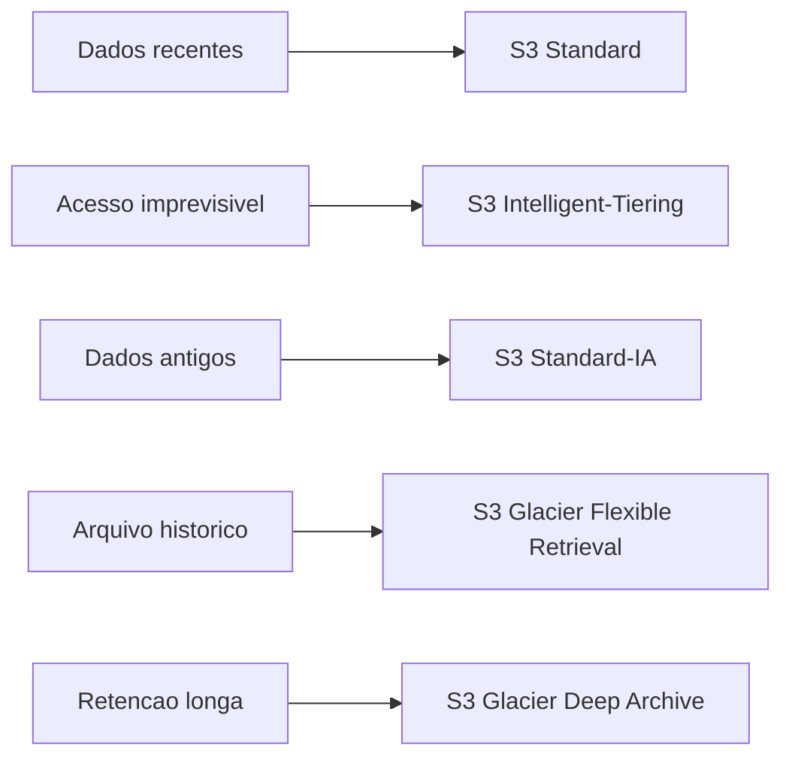

---

title: S3 - Tipos de Armazenamento
layout: default
description: Classes de armazenamento do Amazon S3 com foco em custo, frequência de acesso e cenários da AWS DEA-C01
---

# S3 - Tipos de Armazenamento

## Visão Geral

O `Amazon S3` tem diferentes classes de armazenamento.

A ideia é simples: nem todo dado precisa do mesmo nível de acesso, custo e disponibilidade.

Um arquivo consultado todos os dias não deveria ser tratado igual a um backup antigo que talvez nunca seja acessado. Por isso, o S3 oferece classes diferentes para equilibrar:

* frequência de acesso;
* custo de armazenamento;
* custo de recuperação;
* tempo de recuperação;
* resiliência;
* tipo de uso.

Para a `DEA-C01`, o mais importante é saber escolher a classe certa para o cenário.

---

## S3 Standard

`S3 Standard` é a classe padrão do S3.

Ela é indicada para dados acessados com frequência.

Exemplos:

* arquivos usados por aplicações;
* dados recentes de um data lake;
* logs que ainda estão sendo analisados;
* datasets consultados com frequência;
* camadas ativas de processamento.

Se você não escolher uma classe ao enviar um objeto para um bucket de uso geral, o S3 usa `S3 Standard` por padrão.

Resumo:

```text
S3 Standard = acesso frequente
```

---

## S3 Intelligent-Tiering

`S3 Intelligent-Tiering` é usado quando você não sabe bem o padrão de acesso dos dados.

Ele monitora o acesso aos objetos e move automaticamente os dados entre camadas de acesso, buscando reduzir custo sem exigir que você fique ajustando tudo manualmente. A AWS descreve essa classe como uma opção que move objetos automaticamente entre camadas conforme o padrão de acesso muda.

Use quando:

* o acesso é imprevisível;
* alguns dados são muito acessados e outros quase nunca;
* você quer otimização automática;
* não quer criar regras manuais logo no começo.

Resumo:

```text
S3 Intelligent-Tiering = acesso imprevisível
```

---

## S3 Standard-IA

`IA` significa **Infrequent Access**, ou acesso pouco frequente.

`S3 Standard-IA` é indicado para dados que são acessados com pouca frequência, mas que ainda precisam estar disponíveis rapidamente quando forem necessários.

Exemplos:

* backups recentes;
* dados antigos, mas ainda consultáveis;
* arquivos que não são acessados todo dia;
* dados de recuperação que precisam de acesso rápido.

A AWS indica `S3 Standard-IA` para dados duradouros e pouco acessados, com acesso em milissegundos, mas com cobrança de recuperação.

Resumo:

```text
S3 Standard-IA = pouco acesso, mas recuperação rápida
```

---

## S3 One Zone-IA

`S3 One Zone-IA` também é para dados pouco acessados.

A diferença é que ele armazena os dados em uma única zona de disponibilidade, e não em múltiplas zonas.

Isso reduz custo, mas aumenta risco: se aquela zona tiver um problema grave, o dado pode ser perdido.

Use quando:

* o dado pode ser recriado;
* é uma cópia secundária;
* é uma réplica;
* você quer custo menor;
* não precisa da mesma resiliência do Standard-IA.

A própria AWS recomenda `One Zone-IA` para dados que podem ser recriados se houver falha na zona de disponibilidade.

Resumo:

```text
S3 One Zone-IA = pouco acesso + menor custo + uma AZ
```

---

## S3 Glacier Instant Retrieval

`S3 Glacier Instant Retrieval` é uma classe de arquivamento, mas com recuperação imediata.

Ela faz sentido para dados acessados raramente, mas que ainda precisam ser recuperados em milissegundos.

Exemplos:

* arquivos regulatórios raramente consultados;
* imagens médicas antigas;
* documentos que ficam arquivados, mas precisam abrir rápido;
* dados históricos que podem ser pedidos ocasionalmente.

A AWS descreve o Glacier Instant Retrieval como uma classe para arquivamento com acesso em tempo real, com latência semelhante ao Standard-IA.

Resumo:

```text
Glacier Instant Retrieval = arquivo raro, mas acesso imediato
```

---

## S3 Glacier Flexible Retrieval

`S3 Glacier Flexible Retrieval` é voltado para arquivamento de dados que não precisam ser recuperados imediatamente.

Ele é mais barato para armazenamento, mas a recuperação pode levar minutos ou horas, dependendo da opção escolhida.

Use quando:

* o dado é arquivado;
* o acesso é raro;
* recuperação imediata não é necessária;
* custo de armazenamento é mais importante que velocidade.

Exemplo:

```text
backup antigo que pode esperar algumas horas para ser restaurado
```

A AWS lista o Glacier Flexible Retrieval como uma das classes de arquivamento do S3. Para objetos nessa classe, normalmente é preciso fazer uma operação de restore antes de acessar os dados.

Resumo:

```text
Glacier Flexible Retrieval = arquivo raro, recuperação flexível
```

---

## S3 Glacier Deep Archive

`S3 Glacier Deep Archive` é a opção de menor custo para arquivamento de longo prazo.

Ela é indicada para dados acessados muito raramente, em que a recuperação pode esperar bastante.

Exemplos:

* retenção regulatória;
* backups de longo prazo;
* arquivos históricos;
* dados que precisam ser guardados por anos.

A AWS trata o Glacier Deep Archive como uma classe de arquivamento de longo prazo. A recuperação pode levar horas, e a documentação cita tempos como até 48 horas para recuperação bulk.

Resumo:

```text
Glacier Deep Archive = menor custo, recuperação mais lenta
```

---

## S3 Express One Zone

`S3 Express One Zone` é uma classe mais nova, voltada para alto desempenho e baixa latência dentro de uma única zona de disponibilidade.

Ela é usada quando o acesso precisa ser muito rápido e frequente, normalmente em workloads mais específicos.

Exemplos:

* processamento intensivo;
* aplicações sensíveis a latência;
* workloads que precisam de acesso muito rápido aos objetos;
* cenários em que os dados podem ficar em uma única zona.

A AWS descreve o S3 Express One Zone como uma classe de alto desempenho em uma única zona de disponibilidade. Buckets de diretório usam essa classe e não são compatíveis com transições de Lifecycle.

Para a `DEA-C01`, não costuma ser o foco principal, mas vale reconhecer:

```text
S3 Express One Zone = alta performance, baixa latência, uma AZ
```

---

## Comparação rápida

## Comparação rápida

| Classe | Melhor uso | Atenção para a prova |
| --- | --- | --- |
| `S3 Standard` | Dados acessados com frequência | Alta disponibilidade e baixa latência para dados ativos |
| `S3 Intelligent-Tiering` | Acesso imprevisível | Move dados automaticamente entre camadas conforme o padrão de acesso |
| `S3 Standard-IA` | Pouco acesso, mas recuperação rápida | Menor custo de armazenamento, mas cobra recuperação |
| `S3 One Zone-IA` | Pouco acesso, dado recriável, menor custo | Armazena em uma única AZ, então não é ideal para dados críticos |
| `S3 Glacier Instant Retrieval` | Arquivo raro com acesso imediato | Classe de arquivamento com recuperação em milissegundos |
| `S3 Glacier Flexible Retrieval` | Arquivo raro que pode esperar restore | Pode exigir restore; recuperação leva de minutos a horas |
| `S3 Glacier Deep Archive` | Arquivo de longo prazo e menor custo | Menor custo para retenção longa, mas recuperação é mais lenta |
| `S3 Express One Zone` | Alta performance em uma única AZ | Baixa latência e alto desempenho, mas em uma única AZ |
---

## Exemplo prático em data lake

Imagine um data lake no `S3`.

Uma estratégia comum poderia ser:

```text
dados recentes e muito acessados -> S3 Standard
dados com acesso imprevisível -> S3 Intelligent-Tiering
dados antigos pouco acessados -> S3 Standard-IA
arquivos históricos -> S3 Glacier Flexible Retrieval
retenção de longo prazo -> S3 Glacier Deep Archive
```



---

## Pegadinhas para a prova

* `S3 Standard` é para acesso frequente.
* `S3 Intelligent-Tiering` é bom quando o padrão de acesso é desconhecido.
* `S3 Standard-IA` é pouco acesso com recuperação rápida.
* `S3 One Zone-IA` usa uma única AZ e é melhor para dados recriáveis.
* Classes Glacier são para arquivamento.
* `Glacier Instant Retrieval` tem acesso imediato.
* `Glacier Flexible Retrieval` pode exigir restore antes do acesso.
* `Glacier Deep Archive` é para retenção longa e recuperação mais lenta.
* Classes mais baratas para armazenar podem cobrar mais para recuperar.
* `Lifecycle` ajuda a mover dados entre classes automaticamente.
* Não escolha classe só pelo menor custo de armazenamento; pense também em acesso e recuperação.

---

## Resumo rápido

As classes de armazenamento do S3 existem para equilibrar custo, frequência de acesso e tempo de recuperação.

Para a `DEA-C01`, pense assim:

```text
acesso frequente -> Standard
acesso imprevisível -> Intelligent-Tiering
pouco acesso com recuperação rápida -> Standard-IA
pouco acesso e dado recriável -> One Zone-IA
arquivamento -> Glacier
arquivamento longo e barato -> Deep Archive
```
