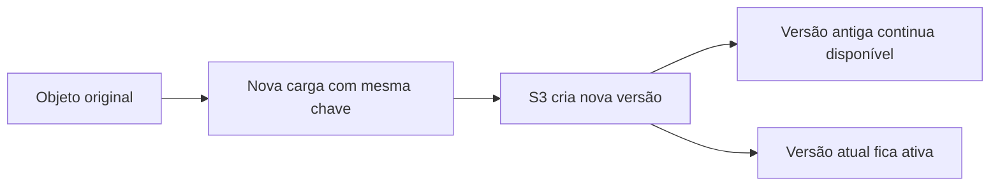

# S3 - Versionamento

## Visão Geral

O versionamento no `Amazon S3` permite manter múltiplas versões do mesmo objeto dentro de um bucket.

Na prática, isso significa que se um arquivo for alterado ou deletado, o S3 pode preservar versões anteriores desse objeto.

Exemplo:

```text
relatorios/vendas.csv
```

Se esse arquivo for enviado novamente com o mesmo nome, o S3 não precisa simplesmente sobrescrever a versão antiga. Com versionamento habilitado, ele cria uma nova versão e mantém a anterior.

Isso é útil para proteção contra erro humano, sobrescrita acidental, exclusão indevida e falhas em jobs de dados.

---

## Por que isso importa em Engenharia de Dados?

Em pipelines de dados, é comum vários processos escreverem no mesmo bucket:

* jobs de ingestão gravando dados brutos;
* jobs do `AWS Glue` reprocessando arquivos;
* aplicações enviando logs;
* cargas periódicas sobrescrevendo arquivos de saída;
* processos de compactação ou conversão para `Parquet`.

Um erro simples pode sobrescrever um arquivo correto.

Exemplo:

```text
curated/vendas/ano=2026/mes=06/vendas.parquet
```

Se um job grava um arquivo errado nessa mesma chave, sem versionamento a versão anterior pode ser perdida.

Com versionamento, a versão antiga continua disponível para recuperação.

---

## Como funciona

Sem versionamento, enviar um objeto com a mesma chave substitui o objeto anterior.

Com versionamento habilitado, cada alteração gera uma nova versão.

Exemplo:

```text
Objeto: raw/pedidos.csv

Versão 1 -> arquivo original
Versão 2 -> arquivo corrigido
Versão 3 -> nova carga
```

Cada versão recebe um `version ID`.

Esse identificador permite acessar uma versão específica do objeto, não apenas a mais recente.

Para a prova, guarde a ideia:

```text
mesma chave, versões diferentes
```

---

## Estado do versionamento

O versionamento de um bucket pode estar em três estados importantes.

| Estado | Ideia |
| --- | --- |
| Desabilitado | Estado padrão para buckets novos |
| Habilitado | O S3 passa a manter versões dos objetos |
| Suspenso | Novas versões deixam de ser criadas, mas versões antigas continuam existindo |

Um detalhe importante: depois que o versionamento é habilitado, você não volta exatamente para o estado inicial. Você pode suspender, mas as versões já criadas continuam armazenadas.

Isso costuma aparecer em questão de prova porque muita gente confunde `suspended` com "apagou o histórico".

Não apagou.

---

## Sobrescrita de objetos

Quando o versionamento está habilitado, sobrescrever um objeto não elimina imediatamente a versão anterior.

Exemplo:

```text
s3://empresa-datalake/raw/pedidos.csv
```

Primeira carga:

```text
pedidos.csv -> version ID 111
```

Segunda carga, usando a mesma chave:

```text
pedidos.csv -> version ID 222
pedidos.csv -> version ID 111
```

A versão `222` passa a ser a versão atual.

A versão `111` continua armazenada como versão anterior.

Isso ajuda muito quando um job grava uma saída errada e você precisa recuperar o conteúdo anterior.

---

## Exclusão de objetos

Com versionamento habilitado, deletar um objeto não funciona do mesmo jeito que em um bucket sem versionamento.

Quando você deleta um objeto sem informar uma versão específica, o S3 adiciona um `delete marker`.

Esse marcador faz o objeto parecer deletado na visualização normal, mas as versões antigas continuam no bucket.

Exemplo:

```text
pedidos.csv -> version ID 111
pedidos.csv -> version ID 222
pedidos.csv -> delete marker
```

Na prática, o objeto parece removido, mas ainda pode ser recuperado removendo o `delete marker` ou acessando uma versão anterior.

Isso é uma das partes mais importantes para a `DEA-C01`.

---

## Delete marker

O `delete marker` é criado quando você deleta um objeto versionado sem especificar uma versão.

Ele vira a versão mais recente do objeto.

Por isso, quando alguém tenta acessar o objeto normalmente, o S3 entende que ele está deletado.

Mas as versões anteriores continuam lá.

Resumo simples:

```text
Delete marker não apaga as versões antigas.
Ele só marca o objeto como deletado na versão atual.
```

Se você excluir uma versão específica, aí sim aquela versão pode ser removida de forma permanente.

---

## Exemplo prático

Imagine um bucket que recebe arquivos de vendas diariamente.

```text
curated/vendas/dia=11/vendas.parquet
```

Um job do `AWS Glue` grava um arquivo errado por engano usando a mesma chave.

Sem versionamento, a versão anterior seria sobrescrita.

Com versionamento, o S3 mantém as duas versões:

```text
v1 -> arquivo correto
v2 -> arquivo errado
```

Nesse caso, é possível recuperar a versão anterior e reduzir o impacto do erro.



---

## Relação com Lifecycle

Versionamento protege contra sobrescrita e exclusão acidental, mas também pode aumentar custo.

Isso acontece porque versões antigas continuam armazenadas.

Por isso, é comum combinar versionamento com regras de `S3 Lifecycle`.

Exemplos:

```text
Mover versões antigas para uma classe mais barata depois de 30 dias
Excluir versões antigas depois de 180 dias
Remover delete markers expirados
```

Essa combinação é importante:

```text
Versionamento protege.
Lifecycle controla custo.
```

Para data lake, isso é bem real. Se um pipeline reprocessa arquivos todos os dias, versões antigas podem crescer rápido.

---

## Relação com MFA Delete

`MFA Delete` adiciona uma camada extra de proteção para exclusões permanentes e mudanças no estado de versionamento.

Com ele, algumas ações exigem autenticação multifator.

Para a prova, basta guardar a ideia:

```text
MFA Delete protege contra exclusão permanente ou alteração crítica no versionamento.
```

Ele aparece menos no dia a dia do que o versionamento comum, mas pode surgir como opção em cenários que pedem proteção extra contra deleção acidental ou maliciosa.

---

## Relação com replicação

Algumas estratégias de replicação do S3 dependem de versionamento habilitado.

Isso faz sentido porque a replicação precisa acompanhar mudanças em objetos ao longo do tempo.

Para a prova, guarde:

```text
S3 Replication exige versionamento habilitado no bucket de origem e no bucket de destino.
```

Se a questão falar de replicação entre buckets e mencionar versionamento, provavelmente esse detalhe é relevante.

---

## Quando usar

Use versionamento quando você quer proteger dados contra:

* sobrescrita acidental;
* exclusão acidental;
* erro em cargas ou jobs;
* necessidade de recuperar versões anteriores;
* alterações indevidas em objetos importantes.

Em data lake, faz sentido considerar versionamento em buckets críticos, principalmente onde existem cargas automatizadas e múltiplos processos escrevendo dados.

---

## Quando não usar ou tomar cuidado

Versionamento não é gratuito em termos de armazenamento.

Se um objeto grande é sobrescrito muitas vezes, as versões antigas continuam ocupando espaço.

Por isso, tome cuidado em buckets com:

* arquivos muito grandes;
* reprocessamentos frequentes;
* alto volume de objetos temporários;
* dados que podem ser recriados facilmente;
* ausência de regras de lifecycle.

Nesses casos, versionamento ainda pode fazer sentido, mas precisa vir junto com uma política clara de retenção.

---

## Comparação rápida

| Recurso | O que resolve |
| --- | --- |
| Versionamento | Recuperar versões anteriores de objetos |
| Lifecycle | Mover ou excluir versões antigas para controlar custo |
| MFA Delete | Exigir MFA para exclusões permanentes e mudanças críticas |
| Replicação | Copiar objetos entre buckets, regiões ou contas |
| Backup | Estratégia mais ampla de recuperação e retenção |

Versionamento ajuda muito, mas não substitui uma estratégia completa de backup, governança, criptografia e controle de acesso.

---

## Pegadinhas para a prova

* Versionamento é configurado no bucket.
* Bucket novo começa com versionamento desabilitado.
* Com versionamento habilitado, sobrescrever um objeto cria uma nova versão.
* Deletar um objeto versionado cria um `delete marker`.
* O `delete marker` não apaga versões antigas.
* Excluir uma versão específica pode remover aquela versão permanentemente.
* Suspender versionamento não remove versões já criadas.
* Versionamento pode aumentar custo, porque versões antigas continuam armazenadas.
* `Lifecycle` ajuda a gerenciar versões antigas e reduzir custo.
* Algumas features, como replicação, dependem de versionamento habilitado.
* Versionamento ajuda na recuperação, mas não substitui backup, governança ou controle de acesso.

---

## Resumo rápido

Versionamento no S3 mantém múltiplas versões do mesmo objeto.

Ele ajuda a recuperar dados sobrescritos ou deletados por engano.

Quando um objeto versionado é deletado sem informar uma versão específica, o S3 cria um `delete marker`, mas as versões antigas continuam existindo.

Para a prova, associe versionamento a proteção, recuperação, `delete marker`, `Lifecycle`, custo, replicação e `MFA Delete`.

---

## Checklist para prova

Antes de responder uma questão sobre S3 Versioning, pergunte:

* O bucket está com versionamento habilitado, suspenso ou desabilitado?
* O objeto foi sobrescrito ou deletado?
* A exclusão criou um `delete marker`?
* A questão fala de excluir uma versão específica?
* Existe risco de aumento de custo por versões antigas?
* O cenário pede lifecycle para limpar versões antigas?
* A questão envolve replicação entre buckets?
* O problema é recuperação simples de objeto ou uma estratégia completa de backup?
