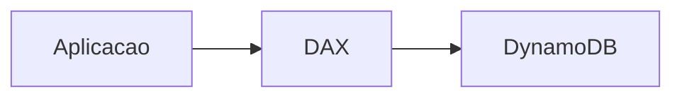

---

title: DynamoDB - DAX
layout: default
description: Introdução simples ao DynamoDB Accelerator com foco em cache, leitura rápida e cenários de uso
---

# DynamoDB - DAX

## Visão Geral

`DAX` significa `DynamoDB Accelerator`.

Ele é um cache em memória gerenciado pela AWS para o `Amazon DynamoDB`. Com DAX, leituras repetidas podem ser respondidas pelo cache, sem precisar ir toda hora na tabela DynamoDB.

---

## Onde o DAX fica

O DAX fica entre a aplicação e o DynamoDB.

A aplicação consulta o DAX.

Se o dado estiver no cache, o DAX responde rápido.

Se não estiver, ele busca no DynamoDB, guarda no cache e retorna para a aplicação.

---

## Quando usar DAX

Use DAX quando a aplicação tem muitas leituras repetidas.

Exemplos:

* perfil de usuário muito acessado;
* catálogo de produtos;
* ranking;
* dados de sessão;
* aplicação com pico grande de leitura.

---

## Cache hit e cache miss

Dois termos aparecem bastante:

| Termo        | Significado                                            |
| ------------ | ------------------------------------------------------ |
| `Cache hit`  | O dado estava no DAX                                   |
| `Cache miss` | O dado não estava no DAX e precisou buscar no DynamoDB |

Quanto mais `cache hit`, maior tende a ser o ganho.

---

## DAX vs ElastiCache

DAX é específico para DynamoDB.

`ElastiCache` é um serviço de cache mais genérico, usando Redis ou Memcached.

| Serviço       | Uso                            |
| ------------- | ------------------------------ |
| `DAX`         | Cache integrado ao DynamoDB    |
| `ElastiCache` | Cache genérico para aplicações |

**O ElastiCache pode ser usado no contexto do DynamoDB para salvar agragações em cache**

---
