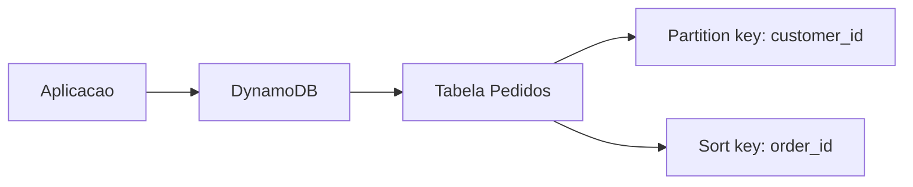

---

title: DynamoDB - Introdução
layout: default
description: Introdução ao Amazon DynamoDB com foco em NoSQL, tabelas, itens, atributos, chaves e cenários comuns na AWS DEA-C01
---

# DynamoDB - Introdução

## Visão Geral

`Amazon DynamoDB` é um banco de dados `NoSQL` totalmente gerenciado pela AWS.

Ele é usado quando a aplicação precisa de baixa latência, alta escala e acesso rápido aos dados.

Diferente de bancos relacionais, como `PostgreSQL` ou `MySQL`, o DynamoDB não trabalha com tabelas relacionais cheias de joins. Ele trabalha com tabelas, itens e atributos.

Um jeito simples de pensar:

```text
Banco relacional -> linhas, colunas, joins e SQL
DynamoDB -> itens, atributos, chaves e acesso por padrão de consulta
```

Para a `DEA-C01`, o mais importante é entender que o DynamoDB é muito forte para aplicações transacionais em larga escala, mas não é a escolha natural para analytics pesado.

---

## O que é NoSQL?

`NoSQL` é um termo usado para bancos que não seguem o modelo relacional tradicional.

No caso do DynamoDB, o modelo é de chave-valor e documento.

Isso significa que os dados são acessados principalmente por chaves.

Exemplo:

```text
customer_id = 123
```

A aplicação usa essa chave para buscar rapidamente o item correspondente.

O DynamoDB também permite atributos flexíveis. Nem todos os itens da tabela precisam ter exatamente os mesmos campos.

Exemplo:

```json
{
  "customer_id": "123",
  "nome": "Ana",
  "plano": "premium"
}
```

Outro item da mesma tabela poderia ter atributos diferentes:

```json
{
  "customer_id": "456",
  "nome": "Bruno",
  "cidade": "Recife",
  "ultimo_login": "2026-06-12"
}
```

Essa flexibilidade é uma das diferenças em relação a bancos relacionais.

---

## Tabela

No DynamoDB, uma tabela é onde os itens ficam armazenados.

Exemplo:

```text
Tabela: Clientes
```

Dentro da tabela, você armazena itens.

```text
Cliente 123
Cliente 456
Cliente 789
```

A tabela precisa ter uma chave primária definida.

Essa chave é usada para identificar e acessar os itens de forma eficiente.

---

## Item

Um item é um registro dentro da tabela.

Ele é parecido com uma linha em um banco relacional, mas com mais flexibilidade.

Exemplo de item:

```json
{
  "customer_id": "123",
  "nome": "Ana",
  "plano": "premium",
  "status": "ativo"
}
```

Cada item é formado por atributos.

Para a prova, pense assim:

```text
item = registro dentro da tabela
```

---

## Atributo

Atributo é um campo dentro de um item.

No exemplo abaixo:

```json
{
  "customer_id": "123",
  "nome": "Ana",
  "plano": "premium"
}
```

Os atributos são:

```text
customer_id
nome
plano
```

Um ponto importante: o DynamoDB é mais flexível que um banco relacional. Alguns atributos podem existir em um item e não existir em outro.

Mas isso não significa que você pode modelar sem pensar. No DynamoDB, a modelagem depende muito de como a aplicação vai consultar os dados.

---

## Chave primária

A chave primária identifica os itens da tabela.

No DynamoDB, ela pode ser de dois tipos:

| Tipo                     | Como funciona                                      |
| ------------------------ | -------------------------------------------------- |
| Partition key            | Usa apenas uma chave                               |
| Partition key + sort key | Usa uma chave de partição e uma chave de ordenação |

---

## Partition Key

A `partition key` é a chave usada para distribuir e localizar os dados.

Exemplo:

```text
customer_id
```

Se a tabela usa apenas `customer_id` como chave primária, cada item precisa ter um `customer_id` único.

Exemplo:

```text
customer_id = 123
```

Para a prova, guarde:

```text
partition key = chave principal usada para distribuir e acessar os dados
```

Uma boa partition key deve distribuir bem os acessos. Se muitos acessos caem sempre no mesmo valor, pode haver concentração de carga.

---

## Sort Key

A `sort key` é usada junto com a partition key.

Ela permite armazenar vários itens com a mesma partition key, diferenciando-os pela ordenação.

Exemplo:

```text
partition key: customer_id
sort key: order_id
```

Isso permite ter vários pedidos para o mesmo cliente:

```text
customer_id = 123 | order_id = A001
customer_id = 123 | order_id = A002
customer_id = 123 | order_id = A003
```

Esse modelo é útil quando você quer consultar vários itens relacionados a uma mesma entidade.

Exemplo:

```text
buscar todos os pedidos do cliente 123
```

Para a prova:

```text
sort key = organiza itens dentro da mesma partition key
```

---

## DynamoDB não é relacional

Esse ponto é importante.

No DynamoDB, você não modela pensando primeiro em normalização e joins.

Você modela pensando nos padrões de acesso.

Ou seja, antes de criar a tabela, você precisa saber como a aplicação vai consultar os dados.

Exemplos:

```text
buscar pedido por order_id
listar pedidos de um cliente
buscar eventos de um usuário por data
consultar sessão ativa por user_id
```

A modelagem deve facilitar essas consultas.

Se você tentar usar DynamoDB como se fosse um banco relacional, provavelmente vai sofrer.

Para a prova, lembre:

```text
DynamoDB é modelado por padrão de acesso, não por joins
```

---

## Capacidade: On-Demand e Provisioned

O DynamoDB tem modos de capacidade.

Os dois principais são:

| Modo        | Ideia                                       |
| ----------- | ------------------------------------------- |
| On-Demand   | A AWS ajusta capacidade conforme o uso      |
| Provisioned | Você define capacidade de leitura e escrita |

### On-Demand

`On-Demand` é bom quando o tráfego é imprevisível ou variável.

Você não precisa definir capacidade antes.

Exemplo:

```text
aplicação nova com volume incerto
```

### Provisioned

`Provisioned` é bom quando o tráfego é mais previsível.

Você define unidades de leitura e escrita, e pode usar auto scaling para ajustar.

Exemplo:

```text
aplicação com padrão de acesso conhecido
```

Para prova:

```text
tráfego imprevisível -> On-Demand
tráfego previsível -> Provisioned
```

---

## Índices

Às vezes, a chave principal da tabela não atende todos os padrões de consulta.

Nesse caso, você pode usar índices.

Os principais são:

* `GSI`: Global Secondary Index;
* `LSI`: Local Secondary Index.

Para uma introdução, guarde só a ideia:

```text
índice = outra forma de consultar os dados
```

Exemplo:

A tabela principal usa `customer_id`, mas você também precisa buscar por `email`.

Nesse caso, pode fazer sentido criar um `GSI` usando `email` como chave.

```text
Tabela principal -> busca por customer_id
GSI -> busca por email
```

---

## Exemplo prático

Imagine uma aplicação de pedidos.

Você quer consultar rapidamente todos os pedidos de um cliente.

Uma tabela poderia ser modelada assim:

```text
Tabela: Pedidos
Partition key: customer_id
Sort key: order_id
```

Exemplo de dados:

```text
customer_id=123 | order_id=001 | valor=100
customer_id=123 | order_id=002 | valor=250
customer_id=456 | order_id=003 | valor=80
```

Consulta comum:

```text
listar todos os pedidos do cliente 123
```



---

## Como aparece na AWS

DynamoDB aparece em cenários como:

* aplicações serverless;
* APIs com baixa latência;
* aplicações com grande escala;
* dados de sessão;
* carrinho de compras;
* eventos simples por usuário;
* metadados de aplicação;
* integração com `AWS Lambda`;
* uso com `DynamoDB Streams`.

Na `DEA-C01`, ele pode aparecer menos como ferramenta de analytics e mais como fonte de dados, banco operacional ou origem para pipelines.

Exemplo:

```text
DynamoDB -> DynamoDB Streams -> Lambda -> S3
```

Ou:

```text
DynamoDB export -> S3 -> Athena/Glue
```

---

## DynamoDB vs S3 vs RDS

| Serviço      | Melhor uso                              |
| ------------ | --------------------------------------- |
| `DynamoDB`   | NoSQL, baixa latência, acesso por chave |
| `Amazon S3`  | Objetos, data lake, arquivos, logs      |
| `Amazon RDS` | Banco relacional com SQL e joins        |

Exemplo mental:

```text
API precisa buscar item por chave em milissegundos -> DynamoDB
Data lake com arquivos Parquet -> S3
Sistema relacional com joins e transações SQL -> RDS
```

---

## Atenção para a prova

* DynamoDB é NoSQL, não relacional.
* Não é escolha natural para joins complexos.
* A modelagem depende dos padrões de acesso.
* Partition key mal escolhida pode concentrar carga.
* Sort key organiza itens dentro da mesma partition key.
* `On-Demand` é bom para tráfego imprevisível.
* `Provisioned` é bom para tráfego previsível.
* GSI permite consultar por outra chave.
* DynamoDB pode ser origem para pipelines de dados.
* Para analytics no lake, geralmente os dados vão para `S3`.

---

## Quando usar

Use DynamoDB quando:

* a aplicação precisa de baixa latência;
* o acesso é feito por chave;
* o volume pode escalar bastante;
* o modelo não depende de joins complexos;
* o tráfego pode ser alto;
* a aplicação é serverless ou altamente escalável.

Exemplos:

* carrinho de compras;
* sessão de usuário;
* perfil de usuário;
* catálogo simples;
* metadados;
* estado de aplicação.

---

## Quando não usar

DynamoDB pode não ser a melhor escolha quando:

* você precisa de muitos joins;
* o modelo é fortemente relacional;
* as consultas são muito ad hoc;
* o foco é BI e analytics pesado;
* você precisa consultar grandes volumes com SQL analítico.

Nesses casos, pense em `RDS`, `Redshift`, `Athena` ou `S3`, dependendo do cenário.

---

## Resumo rápido

`Amazon DynamoDB` é um banco NoSQL gerenciado, usado para baixa latência e alta escala.

Ele trabalha com tabelas, itens, atributos e chaves.

A modelagem depende dos padrões de acesso.

Para a prova, lembre:

```text
DynamoDB = NoSQL + chave-valor/documento + baixa latência + escala
```

---

## Checklist para prova

* [ ] Saber que DynamoDB é NoSQL
* [ ] Entender tabela, item e atributo
* [ ] Diferenciar partition key e sort key
* [ ] Saber que a modelagem depende do padrão de acesso
* [ ] Associar DynamoDB a baixa latência e alta escala
* [ ] Diferenciar On-Demand de Provisioned
* [ ] Entender que GSI permite consultar por outra chave
* [ ] Não escolher DynamoDB para analytics pesado com joins
* [ ] Associar DynamoDB a Lambda, Streams e pipelines para S3
