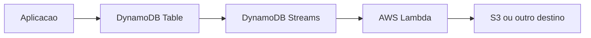

---

title: DynamoDB - Streams
layout: default
description: Introdução simples ao DynamoDB Streams com foco em eventos, alterações na tabela e integração com Lambda
---

# DynamoDB - Streams

## Visão Geral

`DynamoDB Streams` é um recurso que captura alterações feitas nos itens de uma tabela DynamoDB.

Ele registra eventos quando um item é:

```text
criado
alterado
removido
```

A ideia é permitir que outros serviços reajam a mudanças na tabela.

Exemplo:

```text
novo pedido criado no DynamoDB
-> evento aparece no DynamoDB Streams
-> Lambda processa esse evento
```

A AWS descreve DynamoDB Streams como uma sequência ordenada de alterações em nível de item, armazenada por até 24 horas.

---

## Onde Streams entra

O Streams fica ligado a uma tabela DynamoDB.

Quando a tabela muda, o stream recebe um registro dessa mudança.



Ele é muito usado com `AWS Lambda`.

A Lambda pode ser acionada automaticamente quando novos eventos aparecem no stream.

---

## O que o Stream pode guardar

Ao habilitar Streams, você escolhe o tipo de informação que será capturada.

| Opção                | O que guarda                      |
| -------------------- | --------------------------------- |
| `KEYS_ONLY`          | Apenas as chaves do item alterado |
| `NEW_IMAGE`          | Item depois da alteração          |
| `OLD_IMAGE`          | Item antes da alteração           |
| `NEW_AND_OLD_IMAGES` | Antes e depois da alteração       |

Exemplo:

```text
NEW_IMAGE -> mostra como o item ficou depois do update
OLD_IMAGE -> mostra como ele era antes
```

---

## Casos de uso

DynamoDB Streams aparece em cenários como:

* acionar uma `Lambda` após mudança na tabela;
* enviar alterações para outro sistema;
* criar auditoria de mudanças;
* atualizar um índice ou cache;
* replicar eventos para um pipeline;
* mandar dados alterados para `S3`.

--- 

## Streams vs Scan

Streams não serve para ler a tabela inteira.

Ele serve para capturar mudanças novas.

Se você quer ler dados já existentes, usaria outras operações, como `Scan`, `Query` ou export para S3.

Resumo:

```text
Scan -> lê dados da tabela
Streams -> captura mudanças na tabela
```

---

## Streams vs Kinesis

`DynamoDB Streams` é o recurso nativo do DynamoDB para capturar mudanças.

Também existe integração do DynamoDB com `Kinesis Data Streams`, que pode ser melhor quando você precisa de maior retenção, múltiplos consumidores ou um pipeline de streaming mais robusto.

Para a prova, pense assim:

```text
mudança simples na tabela + Lambda -> DynamoDB Streams
streaming mais robusto e múltiplos consumidores -> Kinesis
```

---