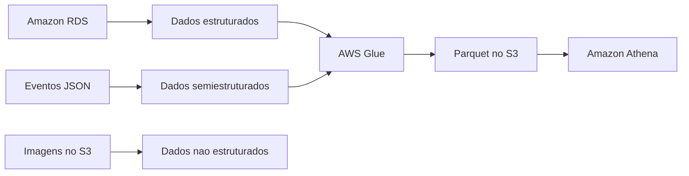

# Conceitos Básicos de Engenharia de Dados

## Visão Geral

Antes de falar de Glue, Athena, Redshift ou qualquer pipeline mais elaborado, tem uma base que precisa estar firme: que tipo de dado você está lidando e quais características desse dado vão impactar armazenamento, processamento e análise.

Parece assunto introdutório demais, mas não é. Muita decisão de arquitetura nasce daqui.

## Tipos de dados

Na prática, a divisão mais comum é esta:

- dados estruturados;
- dados semiestruturados;
- dados não estruturados.

Essa classificação ajuda a entender duas coisas:

- quão previsível é o schema;
- quão fácil vai ser consultar, validar e transformar esse dado.

## Dados estruturados

São os mais organizados. Normalmente vêm em linhas e colunas, com schema fixo e regras claras.

É o tipo de dado que encaixa muito bem em SQL, validação mais rígida e consumo analítico tradicional.

Exemplos:

- tabelas em `Amazon RDS`;
- dados em `Amazon Redshift`;
- arquivos `CSV`;
- planilhas;
- tabelas de sistemas transacionais.

Exemplo simples:

```text
id_cliente | nome | email | data_cadastro
```

Se toda linha respeita esse mesmo desenho, você está no mundo dos dados estruturados.

## Dados semiestruturados

Aqui o dado ainda tem organização, mas não naquele formato rígido de tabela relacional.

É muito comum em:

- respostas de API;
- logs;
- eventos;
- documentos com chaves e valores;
- arquivos com campos opcionais.

Exemplos clássicos:

- `JSON`;
- `XML`;
- `Avro`.

Um ponto importante para a prova: `Parquet` costuma aparecer junto com semiestruturados em alguns resumos, mas ele é mais um formato de armazenamento colunar do que um "tipo de dado" em si. Em contexto de engenharia de dados, o importante é lembrar que ele é excelente para analytics.

Exemplo:

```json
{
  "id_cliente": 123,
  "nome": "Maria",
  "enderecos": [
    {
      "cidade": "Recife",
      "estado": "PE"
    }
  ]
}
```

Isso não está em uma tabela tradicional, mas está longe de ser bagunça total.

## Dados não estruturados

Aqui o dado não traz um schema claro para consulta direta. Você até consegue armazenar, catalogar e processar, mas normalmente precisa de etapas extras antes de extrair valor analítico.

Exemplos:

- imagens;
- vídeos;
- áudios;
- PDFs;
- e-mails;
- documentos livres.

Se você recebe um áudio de atendimento, por exemplo, primeiro precisa transcrever ou enriquecer esse conteúdo antes de tratar aquilo como dado analítico de verdade.

## Por que isso importa em Engenharia de Dados?

Porque o tipo de dado afeta quase tudo:

- o formato ideal de armazenamento;
- o custo de consulta;
- a ferramenta de processamento;
- a estratégia de catálogo;
- a forma de validar;
- a facilidade de consumo.

Não faz sentido tratar um log em JSON do mesmo jeito que uma tabela relacional pronta para BI.

## Como aparece na AWS

Na AWS, isso aparece o tempo todo:

- `Amazon S3` guarda praticamente qualquer tipo de dado;
- `AWS Glue Crawlers` ajudam a inferir schema de arquivos;
- `AWS Glue` e `Amazon EMR` transformam dados estruturados e semiestruturados;
- `Amazon Athena` consulta muito bem dados tabulares e formatos analíticos no `S3`;
- `Amazon Redshift` funciona melhor com dados mais organizados para analytics;
- `Amazon OpenSearch Service` pode entrar quando o dado é mais textual e o caso de uso envolve busca.

## Exemplo prático

Imagina um e-commerce com três origens:

- pedidos em banco relacional;
- eventos de navegação em JSON;
- imagens de produto em arquivos no `S3`.

Nesse cenário:

- os pedidos entram como dados estruturados;
- os eventos entram como semiestruturados;
- as imagens entram como não estruturados.

O pipeline não vai tratar tudo da mesma forma. Os pedidos podem ir para consulta analítica mais direto. Os eventos talvez precisem de flatten, padronização e conversão para `Parquet`. As imagens podem ficar só armazenadas, com metadados separados.



## Pegadinhas para a prova

- `CSV` é simples, mas continua sendo dado estruturado.
- `JSON` e `XML` são semiestruturados, não não estruturados.
- `Parquet` não é "tipo de dado"; é formato de armazenamento muito usado em analytics.
- `S3` armazena qualquer formato, mas isso não significa que qualquer formato será fácil de consultar.
- Dado não estruturado pode fazer parte da arquitetura, mas nem sempre é foco principal da DEA-C01.

## Quando usar

Esse assunto não é algo que você "usa", e sim uma base para decidir melhor:

- quando escolher formato;
- quando planejar ingestão;
- quando definir processamento;
- quando pensar em catálogo e consumo.

## Quando não usar

Não vale complicar demais quando o cenário da prova só quer saber o essencial. Muitas questões não exigem taxonomia perfeita; exigem reconhecer o comportamento do dado e escolher a ferramenta compatível.

## Comparação rápida

| Tipo | Como costuma vir | Facilidade de consulta |
| --- | --- | --- |
| Estruturado | Tabelas, linhas e colunas | Alta |
| Semiestruturado | JSON, XML, eventos, logs | Média |
| Não estruturado | Áudio, vídeo, imagem, texto livre | Baixa |

## Resumo rápido

- Estruturado: schema fixo, consulta fácil.
- Semiestruturado: estrutura flexível, mas ainda organizada.
- Não estruturado: exige mais preparação para análise.
- Na AWS, `S3`, `Glue`, `Athena`, `EMR` e `Redshift` aparecem bastante nesse contexto.

## Checklist para prova

- [ ] Saber diferenciar estruturado, semiestruturado e não estruturado
- [ ] Não confundir `JSON` com dado não estruturado
- [ ] Lembrar que `Parquet` é formato analítico, não categoria de dado
- [ ] Associar `S3` ao armazenamento flexível de vários formatos
- [ ] Entender que o tipo de dado influencia consulta, custo e processamento
