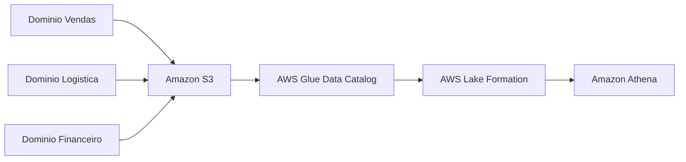

# Data Mesh

## Visão Geral
Segundo IBM - Data Mesh é uma abordagem arquitetural e organizacional descentralizada para a gestão de dados. Em vez de centralizar a responsabilidade e a infraestrutura de dados em uma única equipe de TI, ela delega a propriedade dos dados aos times de negócios (domínios) que os geram e os utilizam

Data mesh é menos sobre ferramenta e mais sobre responsabilidade.

A lógica é tirar dos ombros de um time central toda a missão de entender, produzir e manter os dados da empresa inteira. Em vez disso, cada domínio de negócio passa a cuidar melhor dos próprios dados.

Vendas cuida dos dados de vendas. Financeiro cuida dos dados financeiros. Logística cuida dos dados de logística.

## Por que isso importa em Engenharia de Dados?

Porque muitos times de dados crescem e viram gargalo.

O que costuma acontecer:

- todo mundo depende de uma equipe central;
- o backlog de pipeline só cresce;
- aparecem tabelas sem dono;
- a plataforma escala tecnicamente, mas não operacionalmente.

O data mesh tenta atacar isso distribuindo ownership sem abandonar padrão, segurança e governança.

## Como aparece na AWS

Na AWS, esse modelo costuma usar:

- `Amazon S3` como base do lake;
- `AWS Glue Data Catalog` para metadados;
- `AWS Glue` e `Amazon EMR` para processamento;
- `Amazon Athena` para consumo;
- `AWS Lake Formation` para governança;
- `AWS IAM` e `AWS KMS` para controle de acesso e criptografia.

O ponto é importante: não existe um "serviço data mesh". A AWS entra como conjunto de peças para viabilizar o modelo.

## Exemplo prático

Uma empresa tem três domínios fortes:

- vendas;
- logística;
- financeiro.

Cada domínio publica seus próprios datasets curados no `S3`, registra metadados no `Glue Data Catalog`, define dono, documentação mínima e regras básicas de qualidade.

O time de plataforma não some. Ele passa a cuidar da base comum:

- padrões de bucket;
- catálogo;
- permissões;
- templates de pipeline;
- monitoramento;
- governança.

## Pegadinhas para a prova

- data mesh não é data lake;
- data mesh não é um serviço da AWS;
- autonomia de domínio não significa ausência de padrão;
- 
## Quando usar

- muitos domínios de negócio maduros;
- time central virou gargalo;
- necessidade de ownership claro;
- plataforma já tem alguma maturidade.

## Comparação com conceitos parecidos

| Conceito | Foco |
| --- | --- |
| Data Lake | Armazenar dados |
| Data Warehouse | Organizar para analytics |
| Data Mesh | Distribuir ownership e operação |

## Resumo rápido

- Data mesh redistribui responsabilidade por domínio.
- Não substitui governança.
- Na AWS, costuma usar `S3`, `Glue`, `Athena` e `Lake Formation`.
- É mais modelo operacional do que stack técnica.

## Checklist para prova

- [ ] Lembrar que não é serviço AWS
- [ ] Distinguir data mesh de data lake
- [ ] Associar o tema a ownership por domínio
- [ ] Entender o papel da governança federada
- [ ] Reconhecer cenários em que o gargalo é organizacional
