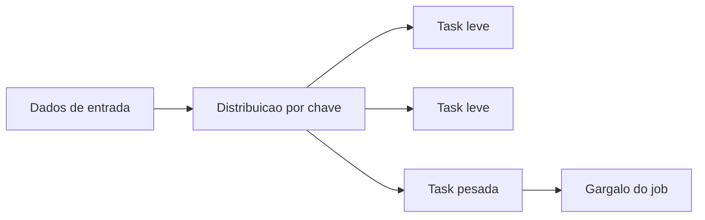

# Data Skew

## Visão Geral

Data skew acontece quando os dados não se distribuem de forma equilibrada entre partições ou tasks.

Na teoria, processamento distribuído deveria dividir o trabalho. Na prática, se uma partição recebe volume demais e as outras quase nada, o paralelismo fica capenga.

É aquele tipo de problema em que o cluster parece grande, mas uma parte do job continua demorando demais porque quase todo o peso caiu no mesmo lugar.

## Por que isso importa em Engenharia de Dados?

Porque skew derruba performance, aumenta custo e pode até quebrar jobs.

Os sintomas clássicos são:

- uma task demora muito mais que as outras;
- uso de memória fica desigual;
- join fica caro demais;
- o job parece "travado" perto do fim;
- subir mais recurso não resolve tanto quanto deveria.

## Como aparece na AWS

Na AWS, isso costuma aparecer em:

- jobs Spark no `AWS Glue`;
- processamento no `Amazon EMR`;
- joins grandes;
- agregações pesadas;
- particionamento ruim em dados no `S3`.

Um caso bem comum é chave muito concentrada. Exemplo: um `customer_id` ou `tenant_id` com volume muito maior que o restante.

## Exemplo prático

Você faz um join no `AWS Glue` entre eventos e cadastro de clientes usando `customer_id`.

Quase todos os clientes têm poucos registros, mas um parceiro gigante concentra milhões de eventos com a mesma chave. O resultado é que uma task recebe peso demais e segura o job inteiro.

## Pegadinhas para a prova

- skew não é só volume alto; é volume mal distribuído;
- aumentar cluster nem sempre resolve se a chave continua concentrada;
- partição ruim e join ruim podem gerar sintomas parecidos;
- nem toda lentidão em Spark é skew.

## Como mitigar

O importante para a prova é reconhecer a lógica das soluções:

- melhorar a chave de partição;
- revisar a estratégia de join;
- usar `broadcast join` quando um lado é pequeno;
- isolar ou tratar valores extremos;
- reorganizar melhor os dados.

Não precisa decorar tuning avançado de Spark para DEA-C01.

## Quando usar

Não é algo que se "usa". É um problema que você precisa identificar quando o processamento distribuído não escala como deveria.

## Quando não usar

Não chame de skew quando o problema real for:

- leitura excessiva de arquivo;
- arquivo pequeno demais em grande quantidade;
- gargalo externo de rede ou banco;
- dimensionamento ruim sem concentração real de chave.

## Comparação com conceitos parecidos

| Conceito | Ideia |
| --- | --- |
| Data Skew | Distribuição desigual de dados |
| Shuffle alto | Muito movimento de dados entre nós |
| Small files problem | Muitos arquivos pequenos |
| Particionamento ruim | Organização ruim dos dados para consulta ou processamento |

## Resumo rápido

- Data skew é desequilíbrio de distribuição.
- Ele prejudica jobs distribuídos.
- Aparece muito em `Glue`, `EMR`, Spark, joins e agregações.
- O sintoma clássico é uma partição segurando o job inteiro.

## Checklist para prova

- [ ] Entender que skew é concentração desigual
- [ ] Associar skew a jobs distribuídos
- [ ] Lembrar de joins e agregações como pontos comuns
- [ ] Saber que mais cluster não resolve tudo
- [ ] Não confundir skew com qualquer problema genérico de performance
