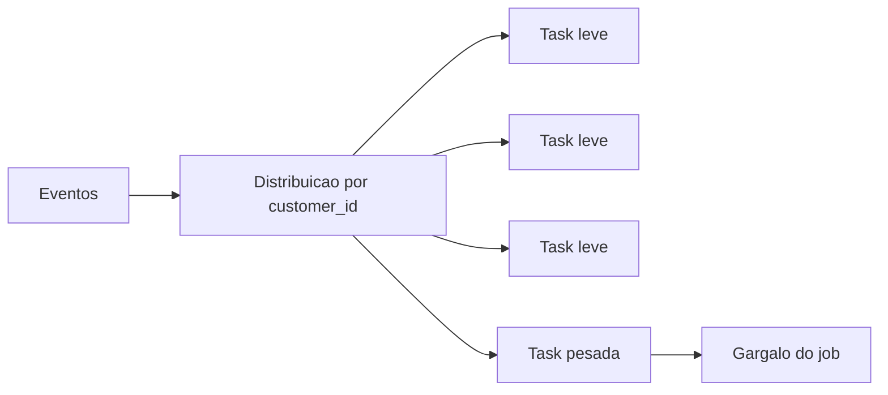

---

title: Data Skew
layout: default
description: Desequilíbrio na distribuição dos dados e impacto em processamento distribuído
---

# Data Skew

## Visão Geral

Data skew é um daqueles problemas que parecem simples, mas que conseguem derrubar bastante a performance de um job.

A ideia do processamento distribuído é dividir o trabalho entre várias tasks. Em ferramentas como Spark, `AWS Glue` e `Amazon EMR`, cada task processa uma parte dos dados.

O problema é que essa divisão nem sempre fica justa.

Às vezes, uma partição recebe dados demais, enquanto outras recebem pouco. Aí várias tasks terminam rápido, mas uma task específica continua rodando por muito tempo e segura o job inteiro.


Imagine um job dividido em 10 partições.

Nove partições têm 100 mil registros cada.
Uma partição tem 10 milhões.

Mesmo com um cluster grande, o tempo final do job vai depender dessa partição mais pesada.


Na prática, é aquele cenário em que o job parece estar quase acabando, mas fica preso nos últimos porcentos. Não porque o cluster inteiro está ocupado, mas porque uma ou poucas tasks ficaram com quase todo o trabalho.

---

## Por que isso importa em Engenharia de Dados?

Porque Spark, Glue e EMR dependem muito de paralelismo.

Se o trabalho está bem distribuído, várias máquinas conseguem processar ao mesmo tempo.
Se uma parte dos dados fica concentrada, o paralelismo perde força.

O resultado pode ser:

* job demorando muito mais que o esperado;
* uma task consumindo muito mais memória;
* erro por falta de memória;
* join ficando caro demais;
* cluster subutilizado;
* custo maior sem ganho real de performance.

Um sinal bem comum é ver várias tasks finalizadas e uma ou poucas tasks ainda rodando por muito tempo.

---

## Como isso aparece na AWS

Na AWS, data skew costuma aparecer principalmente em jobs Spark rodando no `AWS Glue` ou no `Amazon EMR`.

Também aparece bastante quando o pipeline faz:

* joins grandes;
* agregações pesadas;
* `group by`;
* `distinct`;
* `order by`;
* shuffle de muitos dados;
* leitura de dados particionados de forma ruim no `S3`.

Um exemplo comum é uma chave muito concentrada.

Pode ser um `customer_id`, `tenant_id`, `partner_id`, `country` ou até um `status`.

A maioria dos valores aparece pouco, mas um valor específico aparece demais. Quando o Spark usa essa chave para distribuir o trabalho, esse valor gigante pode cair em uma partição muito maior que as outras.

---

## Relação com particionamento

Particionamento tem tudo a ver com data skew.

Quando escolhemos uma coluna para particionar os dados, estamos tentando organizar melhor a leitura e o processamento. Só que nem toda coluna é boa para isso.

Um exemplo ruim seria particionar por `status` quando quase todos os registros têm o mesmo valor.

```text
status = ACTIVE      -> 95% dos registros
status = INACTIVE    -> 4% dos registros
status = BLOCKED     -> 1% dos registros
```

Nesse caso, a partição `ACTIVE` fica enorme. As outras quase não têm dados.

Ou seja, o particionamento existe, mas não ajuda tanto assim. Pior: pode criar desequilíbrio.

Outro exemplo:

```text
customer_id = 1001   -> 10 milhões de eventos
customer_id = 1002   -> 10 mil eventos
customer_id = 1003   -> 8 mil eventos
customer_id = 1004   -> 12 mil eventos
```

Mesmo `customer_id` tendo muitos valores diferentes, ainda pode existir skew se um cliente concentra volume demais.

Então não basta olhar se a coluna tem vários valores. É preciso olhar a distribuição real dos dados.

Uma boa chave de particionamento normalmente precisa considerar:

* como os dados são consultados;
* como os dados são processados;
* se os valores estão bem distribuídos;
* se existe algum valor muito dominante;
* se a partição vai ajudar ou atrapalhar o job.

---

## Exemplo prático

Imagine um job no `AWS Glue`.

Você tem uma tabela de eventos e uma tabela de clientes. O join é feito por `customer_id`.

A maioria dos clientes tem poucos eventos. Só que existe um cliente gigante, que concentra milhões de registros.

Durante o join, o Spark precisa juntar os registros com a mesma chave. Então os dados daquele cliente gigante acabam ficando concentrados na mesma região do processamento.

O resultado:

* algumas tasks terminam rápido;
* uma task fica muito mais pesada;
* o job inteiro espera essa task terminar;
* aumentar o cluster pode ajudar pouco;
* o gargalo continua preso naquela chave concentrada.



Esse é um caso clássico de data skew.

---

## Data Skew em joins

Join é um dos lugares onde data skew mais aparece.

Isso acontece porque, para fazer o join, o Spark precisa colocar registros com a mesma chave no mesmo lugar.

Se uma chave aparece muitas vezes, ela pode criar uma partição gigante.

Exemplo:

```text
customer_id = 10 -> milhões de eventos
```

Mesmo que o restante dos clientes esteja bem distribuído, esse cliente específico pode segurar o job.

Por isso, skew em join costuma aparecer quando:

* uma chave aparece muito mais que as outras;
* uma tabela é muito maior que a outra;
* existe concentração em cliente, tenant, país, parceiro ou status;
* o join gera muito shuffle;
* a chave de join não distribui bem os dados.

---

## Data Skew em agregações

Agregações também podem sofrer com skew.

Um exemplo simples:

```sql
SELECT customer_id, COUNT(*)
FROM eventos
GROUP BY customer_id;
```

Se um cliente tem milhões de eventos e os outros têm poucos, a agregação desse cliente vai dar muito mais trabalho.

Isso pode acontecer em operações como:

* `GROUP BY`;
* `COUNT`;
* `SUM`;
* `DISTINCT`;
* `ORDER BY`;
* funções de janela;
* cálculos por chave.

A lógica é parecida com o join: quando uma chave concentra dados demais, uma task fica mais pesada que as outras.

---

## Pegadinhas para a prova

Para a DEA-C01, o mais importante é reconhecer o cenário.

Data skew não significa simplesmente “dataset grande”.

Um dataset grande pode rodar bem se estiver bem distribuído.
Um dataset menor pode rodar mal se quase tudo estiver concentrado em uma chave.

Algumas pegadinhas:

* aumentar o cluster nem sempre resolve;
* skew costuma aparecer em joins e agregações;
* chave de particionamento ruim pode causar skew;
* coluna com baixa cardinalidade pode ser perigosa;
* nem toda lentidão em Spark é skew;
* small files problem é outro problema.

Uma frase boa para guardar:

> O problema não é só o tamanho dos dados. É onde esse tamanho está concentrado.

---

## Como mitigar

Para a prova, você não precisa decorar tuning avançado de Spark. O mais importante é entender a lógica.

Algumas formas de mitigar:

* escolher melhor a chave de particionamento;
* evitar particionar por colunas muito concentradas;
* revisar a estratégia de join;
* usar `broadcast join` quando uma tabela é pequena;
* tratar valores extremos separadamente;
* reorganizar os dados no `S3`;
* reduzir shuffles desnecessários;
* analisar a distribuição dos dados antes de particionar.

Exemplo: se `status = ACTIVE` representa quase todos os registros, particionar só por `status` provavelmente não é uma boa ideia.

E se um único `customer_id` concentra metade da tabela, talvez ele precise de um tratamento especial.

---

## Quando não chamar de Data Skew

Nem toda lentidão em Glue, EMR ou Spark é skew.

Não é data skew quando o problema principal é:

* muitos arquivos pequenos;
* leitura de dados demais;
* gargalo em banco externo;
* problema de rede;
* cluster pequeno demais;
* formato de arquivo ruim;
* falta de filtro;
* particionamento que não ajuda na leitura.

Data skew é especificamente quando o trabalho fica mal distribuído.

---

## Comparação com conceitos parecidos

| Conceito             | Ideia                                                        |
| -------------------- | ------------------------------------------------------------ |
| Data Skew            | Uma ou poucas partições recebem dados demais                 |
| Shuffle alto         | Muitos dados sendo movidos entre nós                         |
| Small files problem  | Muitos arquivos pequenos atrapalhando leitura e planejamento |
| Particionamento ruim | Dados organizados de um jeito que não ajuda o processamento  |
| Cluster pequeno      | Falta geral de recurso                                       |
| Leitura excessiva    | O job lê mais dados do que precisava                         |

---

## Resumo rápido

Data skew é quando o processamento fica desequilibrado porque uma parte dos dados concentra muito mais volume que as outras.

Ele aparece bastante em Spark, `AWS Glue` e `Amazon EMR`, principalmente em joins, agregações e particionamentos ruins.

O sintoma clássico é simples: várias tasks terminam, mas uma fica segurando o job inteiro.

Mais recurso pode ajudar um pouco, mas não resolve a causa se os dados continuarem concentrados na mesma chave.

---

## Checklist para prova

* [ ] Entender que skew é distribuição desigual dos dados
* [ ] Saber que o problema não é só volume alto
* [ ] Associar skew a Spark, `AWS Glue` e `Amazon EMR`
* [ ] Lembrar que joins e agregações são pontos comuns
* [ ] Entender que particionamento ruim pode causar skew
* [ ] Evitar confundir skew com small files problem
* [ ] Saber que aumentar cluster nem sempre resolve
* [ ] Reconhecer chaves concentradas como `customer_id`, `tenant_id` e `partner_id`
* [ ] Diferenciar dados grandes de dados mal distribuídos
