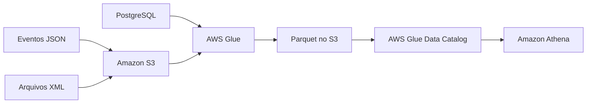

---

title: Fontes de Dados e Formatos Comuns
layout: default
description: Fontes de dados, tipos e formatos mais comuns em pipelines de engenharia de dados na AWS
---

# Fontes de Dados e Formatos Comuns

## Visão Geral

Em Engenharia de Dados, uma **fonte de dados** é o lugar de onde os dados vêm.

Pode ser um banco de dados, uma API, um arquivo, um sistema interno, um log de aplicação ou um fluxo de eventos.

Antes de montar um pipeline, é importante entender a origem do dado, porque cada fonte tem características diferentes. Algumas fontes entregam dados organizados em tabelas. Outras entregam mensagens em tempo real. Outras enviam arquivos periodicamente.

Além da fonte, também é preciso entender o **formato** em que o dado chega.

Por exemplo:

* uma API pode entregar dados em `JSON`;
* um sistema legado pode gerar arquivos `XML`;
* uma exportação manual pode vir em `CSV`;
* uma camada analítica no `S3` pode usar `Parquet`.

Essas decisões afetam a ingestão, o processamento, o custo e a forma como os dados serão consultados depois.

---

## Fonte de dados não é a mesma coisa que formato

Uma confusão comum é misturar fonte de dados com formato de dados.

A **fonte** é de onde o dado vem.

O **formato** é como o dado está representado ou armazenado.

Exemplo:

```text
Fonte: API de pagamentos
Formato: JSON
```

Outro exemplo:

```text
Fonte: Amazon RDS
Formato: tabelas relacionais
```

---

## Por que isso importa?

A fonte e o formato influenciam várias decisões do pipeline.

Eles ajudam a definir:

* como o dado será extraído;
* se o processamento será batch ou streaming;
* qual serviço AWS faz mais sentido;
* como o schema será identificado;

---

## Fontes de dados comuns

### Bancos relacionais

Bancos relacionais são fontes muito comuns em pipelines de dados.

Eles armazenam dados em tabelas, com linhas, colunas e schema definido.

Exemplos:

* `Amazon RDS`;
* `PostgreSQL`;
* `MySQL`;
* `SQL Server`;
* `Oracle`.

Essas fontes costumam ser usadas para dados transacionais, como pedidos, clientes, pagamentos, produtos e contratos.

Em um pipeline, os dados podem ser extraídos desses bancos para análise em outro ambiente, como um data lake no `S3` ou um data warehouse no `Redshift`.

Exemplo:

```text
PostgreSQL -> AWS Glue -> S3 em Parquet -> Athena
```

---

### APIs

APIs são fontes comuns quando os dados vêm de sistemas externos ou aplicações modernas.

Normalmente, uma API entrega os dados em `JSON`.

Exemplos de dados vindos de APIs:

* dados de pagamento;
* dados de CRM;
* integrações com sistemas de terceiros.

---

### Arquivos

Arquivos são uma das fontes mais comuns em pipelines.

Eles podem ser gerados por sistemas, enviados por parceiros, exportados manualmente ou produzidos por outros pipelines.

Formatos comuns:

* `CSV`;
* `JSON`;
* `Parquet`;
* `Avro`;
* `XML`.

Exemplo:

```text
Arquivo CSV recebido no S3 -> Glue transforma -> Parquet no S3 -> Athena consulta
```

---

### Logs

Logs são registros gerados por aplicações, servidores, serviços ou sistemas.

Eles podem conter informações como:

* erro de aplicação;
* acesso de usuário;
* evento de navegação;
* chamada de API;
* tempo de resposta;
* status de processamento.

---

### Streaming e eventos

Streaming é usado quando os dados chegam continuamente, e não apenas em arquivos ou cargas programadas.

Exemplos:

* cliques de usuários;
* eventos de compra;
* telemetria;
* mensagens entre sistemas;
* logs em tempo quase real.

Um exemplo simples:

```text
Eventos da aplicação -> Kinesis Data Firehose -> S3
```

---

### JDBC e ODBC

`JDBC` e `ODBC` não são fontes de dados e também não são formatos de arquivo.

Eles são formas de conexão com bancos de dados.

O `JDBC` é muito usado no ecossistema Java.

O `ODBC` é uma interface mais genérica, comum em ferramentas de BI e integrações diversas.

Eles aparecem quando uma ferramenta precisa se conectar a um banco para ler ou escrever dados.

---

## Formatos de dados comuns

### CSV

`CSV` é um formato simples para dados tabulares.

Cada linha representa um registro, e os valores normalmente são separados por vírgula.

Exemplo:

```csv
id,nome,valor
1,Produto A,100.50
2,Produto B,80.00
```

Pontos positivos:

* fácil de gerar;
* fácil de abrir;
* compatível com muitas ferramentas.

Limitações:

* não preserva bem tipos de dados;
* pode ter problemas com separador e encoding;
* não representa bem dados aninhados;
* não é eficiente para consultas analíticas grandes.

---

### JSON

`JSON` é muito usado em APIs, eventos e logs.

Ele permite representar dados com estrutura flexível, inclusive objetos aninhados.

Exemplo:

```json
{
  "customer_id": 123,
  "event": "purchase",
  "amount": 99.90
}
```

Pontos positivos:

* flexível;
* comum em APIs;
* bom para eventos;
* suporta estruturas aninhadas.

Limitações:

* pode ter schema variável;
* pode ser mais caro de consultar em grande volume;
* nem sempre é ideal como formato final para analytics.


---

### Parquet

`Parquet` é um formato colunar muito usado em data lakes analíticos.

Diferente de formatos orientados a linha, o `Parquet` organiza os dados por coluna.

Isso é importante porque consultas analíticas muitas vezes não precisam ler todas as colunas da tabela.

Exemplo:

Se uma tabela tem 50 colunas, mas a consulta usa apenas 3, um formato colunar permite ler menos dados.

Isso reduz:

* volume lido;
* tempo de consulta;
* custo;
* processamento desnecessário.

Na AWS, `Parquet` aparece muito com:

* `Amazon S3`;
* `Amazon Athena`;
* `AWS Glue`;
* `Redshift Spectrum`.


---

### Avro

`Avro` é um formato usado principalmente para serialização de dados e integração entre sistemas.

Ele trabalha bem com schema e pode ser útil quando existe necessidade de evolução controlada desse schema.

É comum em pipelines de eventos, streaming e troca de dados entre sistemas.

Comparação prática:

| Formato   | Uso mais comum                                |
| --------- | --------------------------------------------- |
| `Parquet` | Consulta analítica                            |
| `Avro`    | Transporte, serialização e evolução de schema |

---

### XML

`XML` é um formato mais comum em sistemas legados e integrações corporativas antigas.

Ele é mais verboso que `JSON` e costuma ser menos prático para analytics moderno.

Mesmo assim, ainda aparece bastante porque muitos sistemas antigos continuam exportando ou recebendo arquivos nesse formato.

Em pipelines modernos, é comum receber `XML`, tratar os dados e converter para um formato mais adequado para análise, como `Parquet`.

---

## Exemplo prático na AWS

Imagine uma empresa que recebe dados de três origens:

* pedidos de um banco `PostgreSQL`;
* eventos de clique em `JSON`;
* relatórios antigos em `XML`.

Um pipeline poderia funcionar assim:

1. Extrair pedidos do `PostgreSQL`;
2. Armazenar eventos `JSON` e arquivos `XML` no `S3`;
3. Usar `AWS Glue` para limpar e padronizar os dados;
4. Converter os dados analíticos para `Parquet`;
5. Registrar as tabelas no `AWS Glue Data Catalog`;
6. Consultar os dados com `Amazon Athena`.



---

## Como aparece na AWS

Na AWS, esse assunto geralmente aparece em arquiteturas de data lake e pipelines de ingestão.

Alguns exemplos:

* `Amazon S3` armazena arquivos brutos e tratados;
* `AWS Glue` transforma os dados;
* `Glue Crawlers` detectam schema em arquivos;
* `Glue Data Catalog` guarda metadados das tabelas;
* `Amazon Athena` consulta arquivos no `S3`;
* `Amazon Kinesis` recebe dados em streaming;
* `Amazon Redshift` armazena dados analíticos em um data warehouse.

Um fluxo comum seria:

```text
Fonte de dados -> S3 bruto -> Glue -> Parquet no S3 -> Athena
```

---

## Atenção para a prova

* Fonte de dados e formato de dados não são a mesma coisa.
* `S3` é armazenamento, não formato.
* `JDBC` e `ODBC` são formas de conexão, não formatos.
* `Parquet` é melhor para consultas analíticas em data lake.
* `Avro` é muito usado em serialização e evolução de schema.
* `XML` aparece bastante em integração legada.

---

## Quando usar cada formato

| Formato   | Quando faz sentido                                      |
| --------- | ------------------------------------------------------- |
| `CSV`     | Exportação simples e dados tabulares pequenos ou médios |
| `JSON`    | APIs, eventos, logs e dados semi-estruturados           |
| `Parquet` | Consultas analíticas em escala no `S3`                  |
| `Avro`    | Integração entre sistemas e evolução de schema          |
| `XML`     | Sistemas legados e integrações corporativas antigas     |

---

## Resumo rápido

Uma fonte de dados é a origem do dado.

Um formato de dados é a forma como esse dado está representado ou armazenado.

Em pipelines na AWS, é comum extrair dados de bancos, APIs, arquivos, logs e eventos, armazenar no `S3`, transformar com `AWS Glue`, catalogar com `Glue Data Catalog` e consultar com `Athena`.

Para a prova, o ponto mais importante é diferenciar fonte, formato e serviço AWS.

---
