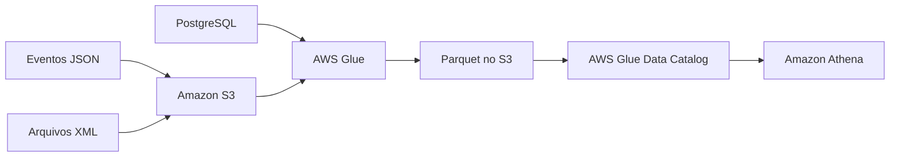

# Fonte de Dados e Tipos de Dados Comuns

## Visão Geral

Quando um pipeline começa, as duas primeiras perguntas costumam ser bem objetivas:

- de onde esse dado vem;
- em que formato ele chega.

Parece básico, mas esse começo já define boa parte do resto: tipo de ingestão, custo de processamento, dificuldade de transformação e até o serviço AWS que faz mais sentido.

## Por que isso importa em Engenharia de Dados?

Porque um pipeline raramente nasce de uma única fonte limpa e padronizada.

No mundo real, você mistura:

- banco relacional;
- API;
- log;
- evento;
- arquivo legado;
- exportação manual.

E cada origem vem com comportamento próprio. Algumas são boas para consulta direta. Outras servem mais como dado de aterrissagem. Algumas são ótimas para analytics. Outras são melhores para troca entre sistemas.

## Fontes de dados mais comuns

## Bancos relacionais

São fontes clássicas para pipelines batch e cargas analíticas.

Exemplos:

- `Amazon RDS`;
- `PostgreSQL`;
- `MySQL`;
- `SQL Server`;
- `Oracle`.

Normalmente entregam dados estruturados, com schema claro, e entram bem em ETL, CDC e replicação.

## APIs

APIs costumam entregar `JSON` e são muito comuns quando o dado vem de SaaS, integrações externas ou aplicações modernas.

A vantagem é a flexibilidade. A desvantagem é que schema e volume podem variar bastante.

## Arquivos

Ainda aparecem demais no dia a dia.

Exemplos:

- `CSV`;
- `JSON`;
- `Parquet`;
- `Avro`;
- `XML`.

Em muita arquitetura na AWS, os arquivos vão parar primeiro no `Amazon S3`, que funciona como zona de aterrissagem.

## Streaming e eventos

Quando o dado chega continuamente, entram cenários de streaming.

Exemplos comuns:

- eventos de navegação;
- telemetria;
- logs em tempo quase real;
- mensagens de aplicações.

Na AWS, isso conversa bem com `Amazon Kinesis Data Streams`, `Kinesis Data Firehose`, `AWS Lambda` e `Amazon S3`.

## JDBC e ODBC

Isso costuma aparecer mais como mecanismo de acesso do que como fonte em si, mas vale revisar porque cai em material introdutório.

`JDBC` é mais ligado ao ecossistema Java.

`ODBC` é mais genérico e costuma aparecer em ferramentas variadas, integrações e drivers de acesso a banco.

Regra simples para lembrar:

- consumidor Java: pense em `JDBC`;
- acesso mais genérico via driver: pense em `ODBC`.

## Tipos de dados e formatos comuns

## CSV

É o formato mais simples da lista.

Bom para troca rápida, exportação e dados tabulares sem muita complexidade.

Pontos fortes:

- fácil de gerar;
- fácil de abrir;
- ampla compatibilidade.

Limitações:

- não preserva bem tipos;
- não lida bem com nested data;
- não é a melhor escolha para analytics em escala.

## JSON

É o formato que mais aparece em API, evento e log moderno.

Bom quando o schema é mais flexível, com campos opcionais ou estruturas aninhadas.

Funciona bem para ingestão, mas não costuma ser o formato final ideal para consulta pesada no lake.

## Parquet

Esse é um dos mais importantes para a DEA-C01.

`Parquet` é colunar. Isso importa porque engines analíticas como `Athena` e `Redshift Spectrum` conseguem ler só as colunas necessárias, reduzindo leitura, custo e tempo de consulta.

Se o cenário for lake analítico em `S3`, `Parquet` quase sempre aparece como uma escolha forte.

## Avro

`Avro` entra muito bem quando a prioridade é serialização, compactação e evolução de schema.

É comum em integração entre sistemas e em alguns pipelines de streaming.

Resumo prático:

- `Parquet`: melhor para leitura analítica;
- `Avro`: melhor para transporte e integração com schema bem controlado.

## XML

Ainda aparece bastante em integração corporativa e sistemas legados.

Não é o formato mais agradável para analytics moderno, mas continua relevante quando a origem já produz XML e você não controla isso.

## Como aparece na AWS

Na AWS, esse tema costuma virar algo assim:

- `S3` recebe arquivos e eventos;
- `Glue Crawlers` detectam schema;
- `Glue` transforma `CSV` e `JSON` em `Parquet`;
- `Athena` consulta arquivos no lake;
- `Kinesis Data Firehose` entrega dados de streaming no `S3`;
- `Redshift` consome dados já preparados para analytics.

## Exemplo prático

Uma empresa recebe:

- pedidos de um `PostgreSQL`;
- eventos de clique em `JSON`;
- relatórios legados em `XML`.

O pipeline faz o seguinte:

- extrai os pedidos do banco;
- aterrissa os eventos e relatórios no `S3`;
- usa `AWS Glue` para padronizar os dados;
- converte o que for analítico para `Parquet`;
- publica tabelas para consulta no `Athena`.

## Pegadinhas para a prova

- `JDBC` e `ODBC` são formas de acesso, não formatos de arquivo.
- `CSV` é simples, mas ruim para analytics grande comparado a `Parquet`.
- `JSON` é ótimo para ingestão, mas costuma perder para `Parquet` no consumo analítico.
- `Avro` e `Parquet` não competem da mesma forma; eles brilham em cenários diferentes.
- `XML` pode continuar aparecendo em cenários reais por legado, mesmo não sendo a melhor opção técnica.

## Quando usar

- `CSV`: troca simples e exportação tabular.
- `JSON`: APIs, logs, eventos e dados flexíveis.
- `Parquet`: data lake analítico em `S3`.
- `Avro`: integração entre sistemas e schema evolution.
- `XML`: quando a origem já depende dele.

## Quando não usar

- evitar `CSV` como formato principal de analytics em larga escala;
- evitar `JSON` cru como camada final de consulta se você pode converter para `Parquet`;
- evitar escolher formato só pela facilidade de gerar, ignorando custo de leitura depois.

## Comparação rápida

| Formato | Melhor uso |
| --- | --- |
| CSV | Dados tabulares simples |
| JSON | APIs, eventos, logs |
| Parquet | Analytics em escala |
| Avro | Troca de dados com schema |
| XML | Integração legada |

## Resumo rápido

- Fonte e formato definem boa parte da arquitetura.
- `JDBC` e `ODBC` ajudam no acesso a bancos.
- `Parquet` é um dos formatos mais importantes para analytics na AWS.
- `JSON` domina ingestão moderna.
- `CSV` continua comum, mas não costuma ser o melhor formato final para o lake.

## Checklist para prova

- [ ] Diferenciar fonte de dados de formato de dados
- [ ] Saber o papel de `JDBC` e `ODBC`
- [ ] Associar `Parquet` a analytics em `S3`
- [ ] Associar `JSON` a APIs e eventos
- [ ] Lembrar que `CSV` é simples, mas menos eficiente para consultas analíticas
