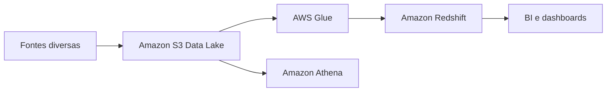

# Data Lake vs Data Warehouse

## Visão Geral

Essa é uma comparação que aparece o tempo todo em arquitetura de dados, e normalmente a confusão começa porque muita gente trata os dois como rivais diretos.

Não são.

Os dois resolvem problemas diferentes. Em muitas arquiteturas boas, os dois convivem.

## Data Warehouse

O data warehouse é a casa dos dados já mais organizados para análise.

Ele funciona melhor quando:

- o schema está bem definido;
- as métricas são relativamente conhecidas;
- o consumo é mais previsível;
- BI e relatórios têm bastante peso.

Na AWS, o nome que você precisa ter na cabeça aqui é `Amazon Redshift`.

O raciocínio do warehouse é este: primeiro você trata, modela e organiza. Depois consulta com performance e consistência.

## Data Lake

O data lake é mais flexível. A proposta é centralizar dados em vários formatos sem exigir modelagem rígida logo na entrada.

Na AWS, a base mais comum é `Amazon S3`.

O lake faz sentido quando você precisa:

- receber muita coisa diferente;
- guardar dado bruto;
- explorar usos ainda não totalmente definidos;
- suportar analytics, ciência de dados e processamento em escala.

Ele aceita a bagunça inicial melhor do que o warehouse. Em troca, cobra mais disciplina de catálogo, governança e organização.

## Por que isso importa em Engenharia de Dados?

Porque essa decisão muda:

- custo de armazenamento;
- formato de ingestão;
- performance de consulta;
- flexibilidade da arquitetura;
- esforço de governança.

Para a DEA-C01, a prova costuma testar se você sabe qual abordagem encaixa melhor no cenário descrito, não se você consegue defender uma moda arquitetural.

## Como aparece na AWS

O desenho mais comum é:

- `Amazon S3` como base do lake;
- `AWS Glue Data Catalog` para metadados;
- `Amazon Athena` para consultar o lake direto;
- `AWS Lake Formation` para governança;
- `Amazon Redshift` para analytics mais estruturado;
- `Redshift Spectrum` para acessar dados no `S3` sem mover tudo para dentro do cluster.

## Exemplo prático

Pensa em uma empresa de varejo:

- logs de navegação;
- pedidos;
- catálogo de produto;
- relatórios financeiros;
- arquivos externos de parceiros.

Os logs e arquivos brutos podem ir para o `S3` primeiro. Depois, parte desse dado é tratada e carregada no `Redshift` para relatórios executivos e dashboards estáveis.

## Data Lake vs Data Warehouse

O jeito mais prático de lembrar:

- lake: guarda com flexibilidade;
- warehouse: organiza para consumo analítico rápido.

| Critério | Data Lake | Data Warehouse |
| --- | --- | --- |
| Dados de entrada | Brutos, variados, estruturados ou não | Mais tratados e organizados |
| Schema | Mais flexível | Mais definido |
| Armazenamento | Geralmente mais barato | Geralmente mais caro |
| Consumo | Exploração, processamento, analytics | BI, relatórios, SQL analítico |
| AWS mais comum | `S3`, `Glue`, `Athena` | `Redshift` |

## Lakehouse

Lakehouse é a tentativa de reduzir a distância entre esses dois mundos.

A ideia é manter a flexibilidade do lake, mas com recursos que deixam o ambiente mais confiável para analytics tabular, com melhor controle de tabela, metadados e evolução.

Na AWS, isso costuma aparecer com combinações como:

- `S3` + `Apache Iceberg` + `Athena`;
- `S3` + `Glue Data Catalog`;
- `S3` + `Lake Formation`;
- `S3` + `Redshift Spectrum`.

Não precisa tratar lakehouse como bala de prata. Para a prova, o mais importante é reconhecer o padrão.

## Pegadinhas para a prova

- data lake não é sinônimo de dado bagunçado, embora isso aconteça quando a governança falha;
- warehouse não é melhor em tudo; ele é melhor para consumo mais estruturado;
- `S3` é base clássica de lake, enquanto `Redshift` é referência forte de warehouse na AWS;
- `Redshift Spectrum` é útil quando você quer consultar dados no `S3` sem carregar tudo no warehouse;
- lakehouse é relevante, mas normalmente não substitui o entendimento básico de lake vs warehouse.

## Quando usar

Use data lake quando:

- há muita variedade de formato;
- a entrada é grande e heterogênea;
- você quer armazenar bruto e decidir depois o consumo;
- ciência de dados, exploração e processamento em escala são relevantes.

Use data warehouse quando:

- o consumo principal é BI e analytics estruturado;
- as perguntas de negócio já estão mais definidas;
- performance de consulta e consistência são prioridade.

## Quando não usar

Evite data warehouse como única camada quando:

- você recebe muitos formatos diferentes;
- ainda precisa guardar dado bruto;
- a exploração é muito aberta.

Evite tratar o lake como resposta completa quando:

- o time precisa de consultas altamente organizadas e recorrentes;
- o consumo principal é relatório executivo estável;
- ninguém está cuidando bem de catálogo, particionamento e qualidade.

## Resumo rápido

- `S3` normalmente representa o lake.
- `Redshift` normalmente representa o warehouse.
- Lake é mais flexível na entrada.
- Warehouse é mais forte para analytics estruturado.
- Em muitas arquiteturas, os dois coexistem.

## Checklist para prova

- [ ] Associar `S3` a data lake
- [ ] Associar `Redshift` a data warehouse
- [ ] Entender quando usar `Athena` sobre o lake
- [ ] Lembrar do papel de `Redshift Spectrum`
- [ ] Não tratar lake e warehouse como equivalentes
