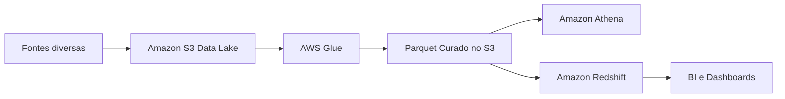

---

title: Data Lake vs Data Warehouse
layout: default
description: Comparação prática entre data lake, data warehouse e lakehouse no contexto AWS
---

# Data Lake vs Data Warehouse

## Visão Geral

Os dois armazenam dados para análise, mas foram pensados para problemas diferentes.

O **data lake** é mais flexível. Ele aceita dados brutos, variados e em vários formatos.

O **data warehouse** é mais estruturado. Ele é pensado para dados organizados, modelados e prontos para consulta analítica.

---

## O que é um Data Lake?

Um **data lake** é um repositório central para armazenar dados em grande volume, geralmente em seu formato original ou com pouca transformação inicial.

Na AWS, o exemplo mais comum é usar o `Amazon S3` como base do data lake.

O data lake pode guardar:

* arquivos `CSV`;
* arquivos `JSON`;
* arquivos `Parquet`;
* logs;
* eventos;
* dados de APIs;
* dados estruturados;
* dados semiestruturados;
* dados não estruturados.

A ideia é não exigir que tudo esteja modelado antes de entrar.

Por isso, o lake costuma ter camadas como:

```text
raw -> trusted -> curated
```

Ou seja:

* **raw**: dado bruto, do jeito que chegou;
* **trusted**: dado limpo e padronizado;
* **curated**: dado pronto para consumo analítico.

O ponto forte do lake é a flexibilidade.

O ponto fraco é que, sem organização, ele pode virar apenas um amontoado de arquivos difíceis de usar.

---

## O que é um Data Warehouse?

Um **data warehouse** é um ambiente analítico mais estruturado.

Ele normalmente recebe dados já tratados, modelados e organizados para responder perguntas de negócio.

Na AWS, o serviço mais associado a data warehouse é o `Amazon Redshift`.

O warehouse costuma ser usado quando o consumo é mais previsível, como:

* dashboards executivos;
* relatórios financeiros;
* indicadores de negócio;
* consultas SQL recorrentes;
* análises com modelo dimensional;
* métricas padronizadas.

A lógica do warehouse é diferente da lógica do lake.

No warehouse, você pensa mais em tabelas bem definidas, relacionamento entre entidades, performance de consulta e consistência dos indicadores.

Exemplo:

```text
vendas_tratadas -> modelo dimensional -> dashboard financeiro
```

O ponto forte do warehouse é entregar dados organizados para consumo analítico.

O ponto fraco é que ele é menos flexível para receber qualquer tipo de dado bruto.

---

## A diferença principal

No data lake, você consegue armazenar primeiro e decidir depois como usar.

No data warehouse, normalmente você organiza antes para entregar um consumo mais controlado.

Uma forma simples de comparar:

| Critério               | Data Lake                                       | Data Warehouse                |
| ---------------------- | ----------------------------------------------- | ----------------------------- |
| Base comum na AWS      | `Amazon S3`                                     | `Amazon Redshift`             |
| Tipo de dado           | Bruto, tratado, estruturado ou não              | Tratado e estruturado         |
| Flexibilidade          | Alta                                            | Menor                         |
| Organização            | Depende de catálogo, camadas e governança       | Mais rígida                   |
| Uso comum              | Exploração, ML, processamento, histórico bruto  | BI, dashboards, relatórios    |
| Formatos               | `CSV`, `JSON`, `Parquet`, `Avro`, logs          | Tabelas relacionais/colunares |
| Custo de armazenamento | Geralmente menor                                | Geralmente maior              |
| Consulta               | `Athena`, `Glue`, Spark, EMR, Redshift Spectrum | SQL no `Redshift`             |

---

## Exemplo prático

Imagine uma empresa de varejo.

Ela recebe:

* pedidos do sistema transacional;
* logs de navegação do site;
* eventos de clique;
* catálogo de produtos;
* arquivos de parceiros;
* dados financeiros tratados.

Nem tudo precisa ir direto para um warehouse.

Os logs, eventos e arquivos externos podem primeiro aterrissar no `S3`, em uma camada bruta.

Depois, o `AWS Glue` pode limpar, padronizar e converter parte desses dados para `Parquet`.

Alguns dados ficam disponíveis no lake para exploração com `Athena`.

Outros são carregados no `Redshift`, porque precisam alimentar dashboards executivos e relatórios recorrentes.



O `S3` guarda com flexibilidade.
O `Glue` transforma.
O `Athena` consulta direto no lake.
O `Redshift` atende análises mais estruturadas.

---

## Onde entra o Lakehouse?

O **lakehouse** aparece para tentar juntar o melhor dos dois.

A ideia é manter os dados no data lake, geralmente no `S3`, mas adicionar recursos que antes eram mais comuns em warehouses.

Por exemplo:

* tabelas mais confiáveis;
* controle de schema;
* evolução de schema;
* transações ACID;
* atualização e deleção de registros;
* melhor controle de metadados;
* consultas analíticas mais organizadas;
* suporte melhor para múltiplos motores lendo os mesmos dados.

Em outras palavras, o lakehouse tenta fazer o lake deixar de ser só um lugar onde arquivos ficam guardados e passar a se comportar mais como uma camada de tabelas analíticas confiáveis.

Na AWS, esse conceito aparece bastante com formatos de tabela abertos, como:

* `Apache Iceberg`;
* `Apache Hudi`;
* `Delta Lake`.

---

## Por que ACID importa no Lakehouse?

Um data lake tradicional trabalha muito com arquivos.

Isso é ótimo para escala e custo, mas traz alguns problemas.

Imagine que um job está escrevendo novos arquivos no `S3` enquanto outro processo está consultando a mesma tabela.

Sem um controle melhor, podem acontecer situações ruins:

* consulta ler dado incompleto;
* job falhar no meio e deixar arquivos quebrados;
* duas escritas concorrentes causarem inconsistência;
* dificuldade para atualizar ou deletar registros;
* schema mudar e quebrar consumidores.

É aqui que entram as **ACID transactions**.

ACID significa:

| Letra       | Ideia                                                   |
| ----------- | ------------------------------------------------------- |
| Atomicity   | A operação acontece inteira ou não acontece             |
| Consistency | O dado sai de um estado válido para outro estado válido |
| Isolation   | Operações concorrentes não se atrapalham                |
| Durability  | Depois de confirmado, o dado permanece gravado          |

No contexto de lakehouse, ACID ajuda a tratar tabelas no lake com mais segurança.

Por exemplo:

Se um job atualiza uma tabela Iceberg no `S3`, os leitores não deveriam enxergar uma atualização pela metade. Eles devem ver a versão anterior ou a nova versão completa.

Isso melhora muito cenários como:

* `MERGE`;
* `UPDATE`;
* `DELETE`;
* reprocessamento;
* múltiplos jobs lendo e escrevendo.

Esse é um dos motivos pelos quais formatos como `Apache Iceberg`, `Hudi` e `Delta Lake` ficaram importantes.

Eles adicionam uma camada de controle em cima dos arquivos do lake.

---

## Data Lake tradicional vs Lakehouse

O lakehouse melhora a forma como algumas tabelas são controladas dentro do lake.

Comparação simples:

| Critério           | Data Lake tradicional                | Lakehouse                                      |
| ------------------ | ------------------------------------ | ---------------------------------------------- |
| Armazenamento      | Arquivos no `S3`                     | Arquivos no `S3` com camada de tabela          |
| Controle de tabela | Mais manual                          | Mais estruturado                               |
| ACID transactions  | Limitado ou inexistente              | Suportado por formatos como Iceberg/Hudi/Delta |
| Atualizações       | Mais difíceis                        | Mais naturais                                  |
| Schema evolution   | Mais trabalhoso                      | Melhor controlado                              |
| Uso                | Armazenar e processar dados variados | Analytics tabular confiável no lake            |

Um jeito simples de pensar:

```text
Data Lake = arquivos organizados no storage
Lakehouse = tabelas confiáveis em cima do lake
```

---

Um fluxo comum:

```text
Fontes -> S3 raw -> Glue -> S3 curated em Parquet/Iceberg -> Athena ou Redshift
```

Outro fluxo comum:

```text
Fontes -> S3 data lake -> Redshift Spectrum -> Redshift/BI
```

---

## Atenção para a prova

Alguns pontos de atenção importantes:

* data lake não é sinônimo de dado bagunçado;
* dado bagunçado no lake é falta de governança, não característica obrigatória;
* warehouse não é “melhor” que lake; ele resolve outro problema;
* `S3` é base comum de data lake na AWS;
* `Redshift` é o serviço clássico de data warehouse;
* `Athena` consulta dados no `S3`;
* lakehouse aparece quando o lake precisa de tabelas mais confiáveis;
* ACID transactions são importantes para evitar inconsistência em atualizações concorrentes;
* `Iceberg`, `Hudi` e `Delta Lake` são formatos de tabela, não bancos de dados.

---

## Comparação rápida

| Critério          | Data Lake                   | Data Warehouse  | Lakehouse                                 |
| ----------------- | --------------------------- | --------------- | ----------------------------------------- |
| Base comum na AWS | `S3`                        | `Redshift`      | `S3` + formato de tabela                  |
| Organização       | Flexível                    | Estruturada     | Intermediária                             |
| Dados brutos      | Sim                         | Normalmente não | Pode manter                               |
| BI recorrente     | Possível, mas exige cuidado | Muito forte     | Possível                                  |
| ACID              | Não é o foco                | Sim             | Sim, via formatos como Iceberg/Hudi/Delta |
| Atualizações      | Mais difíceis               | Naturais        | Mais controladas                          |
| Schema evolution  | Mais manual                 | Controlado      | Melhor suportado                          |
| Custo de storage  | Baixo                       | Maior           | Baixo/intermediário                       |
| Exemplo AWS       | `S3` + `Athena`             | `Redshift`      | `S3` + `Iceberg` + `Athena`               |

---

## Resumo rápido

Data lake é bom para armazenar dados variados com flexibilidade, geralmente usando `S3`.

Data warehouse é bom para consultas analíticas estruturadas, BI e relatórios recorrentes, geralmente usando `Redshift`.

Lakehouse tenta aproximar os dois mundos: mantém os dados no lake, mas adiciona controle de tabela, evolução de schema e transações ACID com formatos como `Iceberg`, `Hudi` e `Delta Lake`.

Para a prova, o mais importante é reconhecer o cenário:

* flexibilidade e dado bruto: lake;
* BI estruturado e performance recorrente: warehouse;
* tabelas confiáveis no lake com ACID: lakehouse.

---
