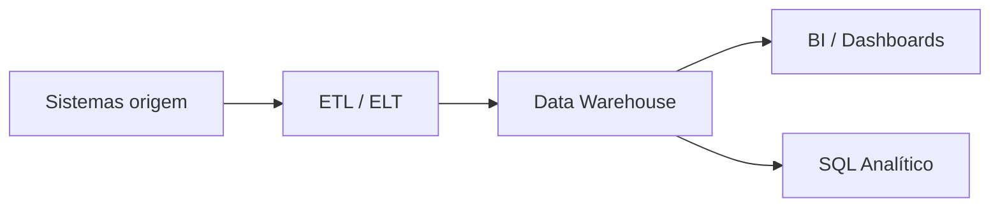
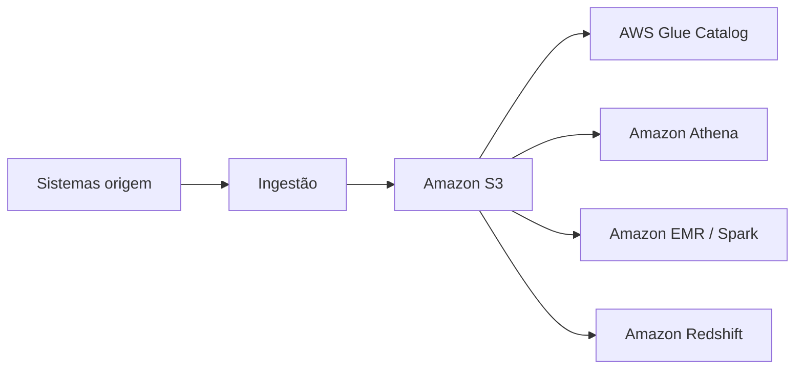
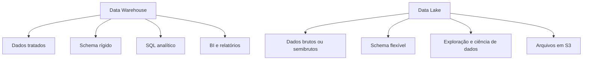
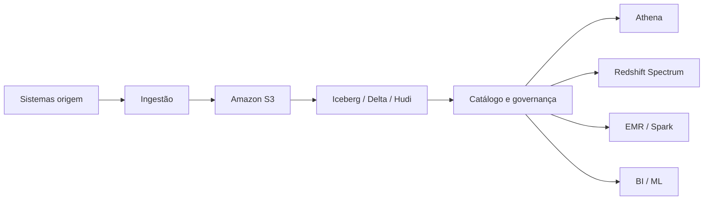

# Data Lake vs Data Warehouse

Quando a gente fala de arquitetura de dados na AWS, quase sempre a discussão cai em uma pergunta simples: onde esses dados vão morar e como eles vão ser usados?

A resposta normalmente passa por três caminhos:

* **Data Warehouse**, quando o foco é consulta analítica organizada.
* **Data Lake**, quando o foco é guardar tudo com flexibilidade.
* **Lakehouse**, quando a ideia é juntar os dois mundos.

Antes de comparar, vale entender cada um com calma.

---

## Data Warehouse

O **data warehouse** é um ambiente preparado para análise de dados com estrutura bem definida. A lógica aqui é simples: os dados entram, passam por transformação e são organizados para consulta rápida e consistente.

Na prática, o warehouse funciona melhor quando a empresa já sabe quais perguntas quer responder. Ele costuma receber dados tratados, padronizados e modelados para relatórios, dashboards e análises de negócio.

Na AWS, o serviço mais clássico para isso é o **Amazon Redshift**.

### Como ele costuma funcionar

### Características

* Dados geralmente estruturados.
* Schema bem definido.
* Alta performance para consultas analíticas.
* Bom para relatórios recorrentes.
* Menos flexível para dados brutos ou formatos variados.

### AWS relacionada

* **Amazon Redshift**: data warehouse gerenciado.
* **Redshift Spectrum**: consulta dados no S3 sem carregar tudo para dentro do cluster.
* **AWS Glue**: ETL e catálogo para preparar dados antes da carga.
* **Amazon QuickSight**: camada de visualização e BI.

### Quando usar

Use data warehouse quando:

* você quer relatórios e dashboards confiáveis;
* os dados já estão bem modelados;
* a equipe precisa responder perguntas de negócio com SQL;
* performance de leitura é mais importante que flexibilidade de ingestão.

Exemplo comum: análise de vendas, receita, churn, funil comercial e indicadores executivos.

---

## Data Lake

O **data lake** é um repositório central para guardar dados em estado bruto ou quase bruto, em qualquer formato. A ideia é armazenar primeiro e decidir depois como vai consumir.

Na AWS, o centro dessa arquitetura é o **Amazon S3**.

O data lake é útil quando você tem muitas fontes diferentes, formatos diferentes e ainda não quer engessar o modelo logo no começo.

### Como ele costuma funcionar

### Características

* Armazena dados estruturados, semiestruturados e não estruturados.
* Aceita JSON, CSV, Parquet, logs, imagens, áudio e muito mais.
* Custo de armazenamento costuma ser baixo.
* Dá liberdade para explorar novos usos dos dados.
* Exige mais disciplina de governança, catálogo e organização.

### AWS relacionada

* **Amazon S3**: camada principal de armazenamento.
* **AWS Glue Data Catalog**: catálogo de metadados.
* **Amazon Athena**: consulta SQL direto sobre arquivos no S3.
* **AWS Lake Formation**: controle de acesso e governança.
* **Amazon EMR** e **AWS Glue**: processamento e transformação.

### Quando usar

Use data lake quando:

* você precisa guardar muitos formatos de dados;
* a origem ainda está em evolução;
* existe interesse em exploração, ciência de dados e machine learning;
* o volume é grande e o custo precisa ser controlado;
* você quer centralizar dados sem modelar tudo de antemão.

Exemplo comum: logs de aplicação, eventos de navegação, arquivos de IoT, JSON de APIs e documentos brutos.

---

## Data Lake vs Data Warehouse

Os dois resolvem problemas diferentes.

O warehouse organiza os dados para consumo analítico rápido.
O lake guarda os dados com mais liberdade e menos imposição de schema.

### Comparação direta

| Critério | Data Lake | Data Warehouse |
| --- | --- | --- |
| Tipo de dado | Qualquer formato | Principalmente estruturado |
| Schema | Flexível | Bem definido |
| Custo de armazenamento | Geralmente menor | Geralmente maior |
| Consulta | Mais dependente de preparação | Mais direta e rápida |
| Público comum | Eng. dados, ciência de dados, ML | BI, analytics, negócio |
| AWS mais comum | S3, Glue, Athena, EMR | Redshift, QuickSight, Glue |

### Leitura prática

Se a empresa quer explorar dados novos, guardar tudo e ainda não sabe exatamente o uso final, o lake tende a fazer mais sentido.

Se a empresa já sabe quais métricas precisa acompanhar e quer um ambiente mais controlado para analytics, o warehouse costuma ser melhor.

Na AWS, é muito comum os dois conviverem no mesmo ecossistema:

* o lake recebe os dados brutos no **S3**;
* o warehouse recebe os dados tratados no **Redshift**;
* o **Athena** acessa arquivos direto no lake;
* o **QuickSight** consome tanto o lake quanto o warehouse, dependendo da arquitetura.

---

## Lakehouse

O **lakehouse** tenta juntar a flexibilidade do data lake com a organização e a performance analítica do data warehouse.

A ideia é simples: manter os dados em um lake, mas com camadas, metadados, governança e suporte forte a consultas analíticas confiáveis.

Na AWS, isso aparece muito em combinações como:

* **S3 + Iceberg + Athena**
* **S3 + Glue Catalog + Redshift Spectrum**
* **S3 + Lake Formation + EMR / Spark**

### Como ele costuma funcionar

### O que ele entrega

* dados no formato de lake;
* consulta mais organizada e confiável;
* suporte a tabelas e metadados mais ricos;
* menos duplicação entre camadas;
* uma ponte entre analytics tradicional e dados em grande escala.

### Quando usar

Use lakehouse quando:

* você quer reduzir a separação rígida entre lake e warehouse;
* precisa de mais governança sem perder flexibilidade;
* quer trabalhar com tabelas abertas em S3;
* a empresa já amadureceu o suficiente para cuidar bem de catálogo, partições e qualidade dos dados.

Em projetos AWS mais modernos, o lakehouse aparece quando o time quer evitar montar dois ambientes paralelos sem necessidade.

---

## Resumo Final

Se eu simplificar bastante:

* **Data Warehouse**: melhor para análise estruturada, relatórios e BI.
* **Data Lake**: melhor para guardar tudo, explorar e escalar com flexibilidade.
* **Lakehouse**: melhor quando você quer unir flexibilidade com organização e governança.

Na AWS, o trio mais importante para guardar na cabeça é:

* **S3** como base do lake;
* **Redshift** como referência de warehouse;
* **Athena, Glue e Lake Formation** como peças que conectam tudo.

Na prática, a arquitetura certa depende menos de moda e mais de contexto:

* volume;
* variedade;
* maturidade do time;
* custo;
* tipo de consumo;
* nível de governança necessário.

Se a dúvida for entre eles, a resposta certa quase nunca é "um substitui o outro". Normalmente é "qual combina melhor com o problema agora".
