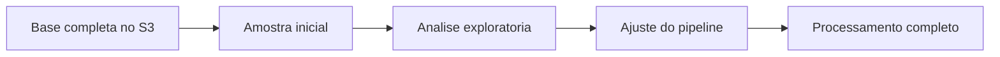

# Técnicas de Amostragem

## Visão Geral

Amostragem é usar só uma parte dos dados para entender o todo sem precisar processar a base inteira.

Em engenharia de dados, isso aparece muito mais do que parece. Nem sempre você quer rodar um job caro só para validar uma hipótese, inspecionar qualidade ou testar uma transformação.

## Por que isso importa em Engenharia de Dados?

Porque trabalhar com 100% dos dados o tempo todo pode ser:

- caro;
- lento;
- desnecessário;
- ruim para exploração rápida.

Amostragem entra bem quando você quer testar um pipeline, investigar distribuição, validar schema, procurar anomalias ou simplesmente olhar o dado antes de decidir o próximo passo.

Na DEA-C01, isso não costuma ser um dos tópicos mais pesados da prova, mas ajuda a entender práticas de exploração e validação.

## Tipos mais comuns

## Amostragem aleatória

É a mais direta.

Você seleciona registros de forma aleatória para tentar montar um recorte representativo da base.

Boa para:

- inspeção geral;
- teste rápido;
- validação inicial;
- análise exploratória.

O cuidado aqui é simples: aleatória não significa automaticamente boa. Se a base for muito desbalanceada, a amostra pode não refletir grupos pequenos importantes.

## Amostragem estratificada

Aqui você separa os dados em grupos antes de amostrar.

Isso faz sentido quando a composição da base importa.

Exemplos:

- pedidos por região;
- clientes por faixa de renda;
- transações por tipo;
- usuários por plano.

Se você quer preservar proporções ou garantir presença mínima de determinados grupos, a estratificada costuma ser melhor que a aleatória pura.

## Amostragem sistemática

É quando você escolhe um intervalo fixo.

Exemplo:

- pegar uma linha a cada 100;
- selecionar um arquivo a cada lote;
- avaliar um evento a cada janela.

Ela é prática, mas pode distorcer o resultado se a ordenação dos dados tiver algum padrão escondido.

## Como aparece na AWS

Esse tema aparece mais como prática de trabalho do que como serviço específico.

Na AWS, amostragem pode acontecer em:

- consultas no `Amazon Athena`;
- testes de transformação no `AWS Glue`;
- análise exploratória em `Amazon EMR`;
- inspeção inicial de arquivos no `Amazon S3`.

O ponto não é "qual serviço faz amostragem", e sim por que você faria isso antes de gastar processamento com tudo.

## Exemplo prático

Imagina uma empresa com bilhões de eventos no `S3`. Antes de converter tudo para `Parquet`, o time quer validar:

- campos nulos;
- distribuição de eventos por tipo;
- formatos de timestamp;
- presença de valores fora do padrão.

Em vez de processar tudo logo de cara, eles pegam uma amostra inicial para entender o comportamento dos dados e ajustar a transformação.

## Pegadinhas para a prova

- amostra rápida não é sinônimo de amostra representativa;
- amostragem sistemática pode enviesar o resultado se existir padrão na ordenação;
- base desbalanceada costuma pedir mais cuidado do que sorteio simples;
- nem todo cenário de validação precisa usar 100% dos dados.

## Quando usar

- exploração inicial;
- teste de pipeline;
- validação de regra;
- análise de distribuição;
- redução de custo em etapas de investigação.

## Quando não usar

Evite depender só de amostra quando:

- a validação exige cobertura total;
- você precisa identificar casos raros mas críticos;
- o dado é muito sensível a outliers;
- a decisão depende de exatidão completa.

## Comparação rápida

| Técnica | Melhor uso |
| --- | --- |
| Aleatória | Visão geral da base |
| Estratificada | Preservar grupos e proporções |
| Sistemática | Coleta simples em intervalos fixos |

## Resumo rápido

- Amostragem ajuda a explorar e validar sem processar tudo.
- Aleatória é simples.
- Estratificada preserva grupos.
- Sistemática é prática, mas pede cuidado com viés.

## Checklist para prova

- [ ] Saber a diferença entre aleatória, estratificada e sistemática
- [ ] Entender que amostra pode introduzir viés
- [ ] Lembrar que amostragem ajuda em exploração e teste
- [ ] Não supor que amostra sempre substitui validação completa
- [ ] Tratar o tema como apoio prático, não como serviço AWS específico
