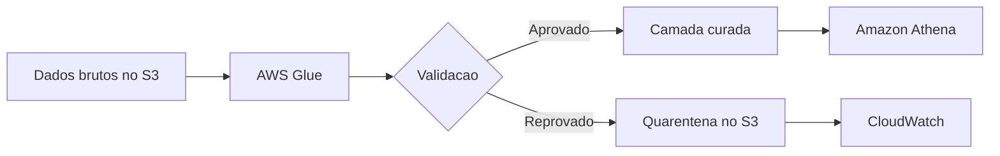

---

title: Validação de Dados
layout: default
description: Validações para impedir que dados ruins avancem no pipeline
---

# Validação de Dados

## Visão Geral

Validação de dados é a etapa em que o pipeline verifica se os dados atendem a regras mínimas antes de seguir para a próxima camada.

Ela serve para responder perguntas como:

* esse campo obrigatório veio preenchido?
* esse valor está em um formato válido?
* essa chave existe?
* esse registro está duplicado?

## Por que isso importa?

Se um dado ruim passa sem controle, pode chegar na camada curada, alimentar um dashboard, alterar uma métrica ou gerar uma decisão errada.

---

## O que normalmente se valida

As validações dependem do domínio, mas algumas aparecem bastante em pipelines de dados.

| Tipo de validação       | Exemplo                                                  |
| ----------------------- | -------------------------------------------------------- |
| Campo obrigatório       | `order_id` não pode ser nulo                             |
| Tipo de dado            | `price` precisa ser numérico                             |
| Formato                 | `event_time` precisa ser um timestamp válido             |
| Faixa de valor          | `price` não pode ser negativo                            |
| Unicidade               | `order_id` não deveria repetir                           |
| Consistência            | pedido `ENTREGUE` precisa ter `delivery_date`            |
| Integridade referencial | `customer_id` precisa existir na tabela de clientes      |
| Atualização esperada    | arquivo diário precisa chegar dentro da janela combinada |

Essas regras ajudam a separar o que está pronto para seguir do que precisa ser investigado.

---

## Exemplo prático

Imagine que chegam arquivos diários de pedidos no `Amazon S3`.

Antes de publicar a tabela para consulta no `Athena`, o pipeline valida algumas regras:

* `order_id` não pode ser nulo;
* `order_id` não pode estar duplicado;
* `price` precisa ser maior ou igual a zero;
* `order_date` precisa ter formato válido;
* se o pedido está `ENTREGUE`, precisa existir `delivery_date`.

O que passa nas regras segue para a camada curada.

O que falha vai para uma área de quarentena no `S3`, junto com o motivo da reprovação.



A quarentena é útil porque nem sempre o melhor caminho é derrubar o pipeline inteiro. Às vezes faz mais sentido isolar os registros inválidos, gerar alerta e permitir que os dados válidos sigam.

---

## Como aparece na AWS

Na AWS, validação de dados pode aparecer em várias partes do pipeline.

Exemplos:

* `AWS Glue`, validando dados durante um job de ETL;
* `Amazon EMR`, em processamento Spark mais customizado;
* `Amazon Athena`, com consultas SQL de checagem;
* `Amazon Redshift`, validando dados antes ou depois da carga;
* `AWS Lambda`, para validações leves ou orientadas a evento;
* `Amazon CloudWatch`, para alertas e monitoramento;
* `Amazon S3`, como área de dados brutos, curados e quarentena.

Um padrão comum é:

```text
raw -> validação -> curated
              \
               -> quarentena
```

---


## Quando usar

Na prática, validação deve existir em todo pipeline importante.

Ela fica ainda mais necessária quando:

* a origem é instável;
* o dado vem de terceiros;
* o dataset é consumido por muitos times;
* o dado afeta métrica financeira;
* existe regra de negócio forte;
* a tabela alimenta dashboard ou processo crítico.

---

## Quando tomar cuidado

O problema geralmente não é validar. É validar mal.

Alguns erros comuns:

* validar só no final do pipeline;
* confiar apenas no schema;
* não registrar o motivo da falha;
* descartar dados inválidos sem rastreabilidade;
* derrubar o pipeline inteiro por erro pequeno e isolado;
* deixar dados ruins passarem sem alerta.

Uma boa validação precisa dizer o que falhou, onde falhou e o que foi feito com aquele registro.

---

## Comparação com conceitos parecidos

| Conceito           | Ideia                                       |
| ------------------ | ------------------------------------------- |
| Validação          | Verificar se o dado atende regras           |
| Transformação      | Modificar o dado                            |
| Limpeza            | Corrigir, padronizar ou remover problemas   |
| Qualidade de dados | Conjunto mais amplo de práticas             |
| Observabilidade    | Monitorar comportamento, falhas e anomalias |
| Quarentena         | Isolar dados inválidos para análise         |

---

## Resumo rápido

Validação de dados é o controle que impede dados ruins de avançarem no pipeline.

Ela pode verificar nulos, tipos, formatos, duplicidades, faixas de valor, consistência e integridade referencial.

Na AWS, costuma aparecer com `Glue`, `EMR`, `Athena`, `Redshift`, `S3` e `CloudWatch`.

Para a prova, lembre: schema válido não garante dado correto, e quarentena pode ser melhor do que simplesmente descartar ou deixar passar.

---
