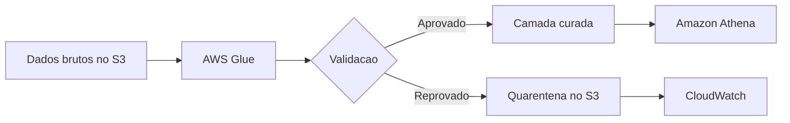

# Validação de Dados

## Visão Geral

Validação de dados é a etapa em que você checa se o dado faz sentido antes de deixar ele seguir adiante.

Não é perfumaria. Se dado ruim entra sem controle, ele contamina tabela curada, métrica, dashboard e decisão de negócio.

## Por que isso importa em Engenharia de Dados?

Porque pipeline "verde" não significa dado confiável.

É perfeitamente possível ter job rodando todo dia e ainda assim entregar:

- duplicidade;
- nulo onde não podia;
- chave quebrada;
- data inválida;
- valor fora de faixa;
- regra de negócio inconsistente.

Na DEA-C01, isso se conecta com qualidade, confiabilidade e publicação segura de datasets.

## O que normalmente se valida

- tipo de dado;
- campo obrigatório;
- formato;
- faixa de valor;
- unicidade;
- consistência entre colunas;
- integridade referencial;
- atualização dentro da janela esperada.

Exemplos:

- `order_id` não pode ser nulo;
- `price` não pode ser negativo;
- `event_time` precisa estar em timestamp válido;
- pedido entregue não deveria estar sem data de entrega.

## Como aparece na AWS

Na AWS, a validação pode entrar em:

- jobs do `AWS Glue`;
- processamento no `Amazon EMR`;
- regras SQL em `Amazon Athena` ou `Amazon Redshift`;
- funções `AWS Lambda`;
- alertas no `Amazon CloudWatch`.

Um padrão comum é separar registros inválidos em uma área de quarentena no `S3`.

## Exemplo prático

Chegam arquivos diários de pedidos no `S3`.

Antes de publicar a tabela final para `Athena`, o pipeline valida:

- colunas obrigatórias;
- unicidade de `order_id`;
- faixa válida de valor;
- formato de data;
- coerência entre status e timestamps.

O que passa vai para a camada curada. O que falha vai para quarentena e gera alerta.

## Pegadinhas para a prova

- validação não é a mesma coisa que transformação;
- schema compatível não garante dado correto;
- qualidade de dados é mais ampla do que validação;
- nem sempre o melhor é derrubar o pipeline inteiro; às vezes o certo é isolar os inválidos.

## Quando usar

Na prática, sempre.

Mas ela fica ainda mais importante quando:

- a origem é instável;
- o dataset vai para muitos consumidores;
- o dado tem impacto financeiro;
- há regra de negócio forte.

## Quando não usar

O erro aqui não é "não usar". É validar mal:

- só no final;
- sem rastreabilidade;
- com regra pesada demais no ponto errado;
- confiando só em schema.

## Comparação com conceitos parecidos

| Conceito | Ideia |
| --- | --- |
| Validação | Checar se o dado atende regras mínimas |
| Limpeza | Corrigir ou padronizar o dado |
| Qualidade de dados | Conceito mais amplo |
| Observabilidade | Monitorar comportamento e falhas |

## Resumo rápido

- Validação impede que dado ruim avance.
- Pode checar nulo, formato, faixa, duplicidade e consistência.
- `Glue`, `Athena`, `Redshift`, `EMR` e `CloudWatch` aparecem bastante nesse contexto.

## Checklist para prova

- [ ] Entender validação como parte de qualidade de dados
- [ ] Saber exemplos comuns de regra
- [ ] Lembrar da quarentena no `S3`
- [ ] Não confundir schema válido com dado certo
- [ ] Associar o tema a confiabilidade do pipeline
